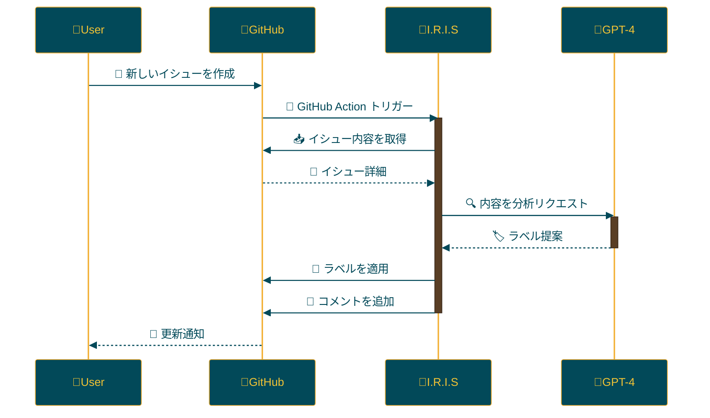

<p align="center">

<br>
<h1 align="center">IRIS</h1>
<h2 align="center">
  ～ Intelligent Repository Issue Solver ～
<br>

<a href="https://github.com/Sunwood-ai-labs/IRIS" title="Go to GitHub repo"></a>

<a href="https://github.com/Sunwood-ai-labs/IRIS"></a>
<a href="https://github.com/Sunwood-ai-labs/IRIS"></a>
<a href="https://github.com/Sunwood-ai-labs/IRIS"></a>


<br>
<p align="center">
  <a href="https://hamaruki.com/"><b>[🌐 Website]</b></a> •
  <a href="https://github.com/Sunwood-ai-labs"><b>[🐱 GitHub]</b></a>
  <a href="https://x.com/hAru_mAki_ch"><b>[🐦 Twitter]</b></a> •
  <a href="https://hamaruki.com/"><b>[🍀 Official Blog]</b></a>
</p>

</h2>

</p>

>[!IMPORTANT]
>このリポジトリのリリースノートやREADME、コミットメッセージの9割近くは[claude.ai](https://claude.ai/)や[ChatGPT4](https://chatgpt.com/)を活用した[AIRA](https://github.com/Sunwood-ai-labs/AIRA), [SourceSage](https://github.com/Sunwood-ai-labs/SourceSage), [Gaiah](https://github.com/Sunwood-ai-labs/Gaiah), [HarmonAI_II](https://github.com/Sunwood-ai-labs/HarmonAI_II)で生成しています。

## 🌟 はじめに

I.R.I.S（Intelligent Repository Issue Solver）は、GitHubリポジトリのイシュー管理を劇的に向上させるインテリジェントアシスタントです。機械学習と自然言語処理を活用し、イシューの自動分類、優先順位付け、解決策の提案を行います。

初めての方でも簡単に使い始められるよう、以下では詳しい説明と手順を記載しています。

## 🚀 機能

- イシューの自動ラベリング：新しいイシューが作成されると、AIがその内容を分析し、適切なラベルを自動的に付与します。
- OpenAI GPT-4を使用したイシュー分析：高度な自然言語処理を用いて、イシューの内容を深く理解します。
- GitHubアクションを通じた自動化プロセス：人間の介入なしに、24時間365日稼働します。

## 📁 リポジトリ構造

```
IRIS/
├─ .github/
│  ├─ disabled-workflows/
│  ├─ scripts/
│  │  └─ process_issue.py
│  └─ workflows/
│     └─ issue-review.yml
├─ docs/
│  └─ .sourcesage_releasenotes.yml
├─ issue_creator.log
└─ README.md
```

## 🛠️ インストールと設定（初心者向けステップバイステップガイド）

1. **リポジトリのクローン**:
   - GitHubアカウントをお持ちでない場合は、まず[GitHubに登録](https://github.com/join)してください。
   - [IRIS リポジトリ](https://github.com/Sunwood-ai-labs/IRIS)にアクセスし、緑色の「Code」ボタンをクリックします。
   - 「Download ZIP」を選択してファイルをダウンロードし、解凍します。

2. **ワークフローファイルのコピー**:
   - 解凍したフォルダ内の [`.github/workflows/issue-review.yml`](.github/workflows/issue-review.yml) ファイルを見つけます。
   - このファイルをあなたのGitHubリポジトリの `.github/workflows/` ディレクトリにコピーします。
     （`.github/workflows/` ディレクトリがない場合は作成してください）

3. **GitHubシークレットの設定**:
   - GitHubリポジトリのページで「Settings」タブをクリックします。
   - 左側のメニューから「Secrets and variables」→「Actions」を選択します。
   - 「New repository secret」ボタンをクリックし、以下のシークレットを追加します：
     - `OPENAI_API_KEY`: OpenAIのAPIキー
     - `GH_ACCESS_TOKEN`: GitHubのパーソナルアクセストークン
   - これらのキーの取得方法が分からない場合は、各サービスのドキュメントを参照するか、開発者に相談してください。

## 🔧 使用方法

IRISを設定したら、以下のように動作します：

1. あなたのリポジトリに新しいイシューが作成されると、IRISが自動的に起動します。
2. AIがイシューの内容を分析します。
3. 適切なラベルが提案され、自動的にイシューに適用されます。
4. ラベリングの結果がイシューにコメントとして追加されます。

特別な操作は必要ありません。新しいイシューを作成するだけで、IRISが自動的に処理を行います。

## 📝 更新情報

- [v0.1.0: 初期リリース](https://github.com/Sunwood-ai-labs/IRIS/releases/tag/v0.1.0): イシュー自動ラベリング機能の実装

## 🔄 ワークフロー

IRISの動作フローを以下の図で説明します：



## 🧪 開発用コマンド（上級者向け）

IRISの開発に携わる方向けのコマンドです：

AIRAを使用してコミットメッセージを生成：
```bash
aira --mode=commit --config=.aira\config.IRIS.yml
```

SourceSageを使用してリリースノートを生成：
```bash
sourcesage --yaml-file=docs\.sourcesage_releasenotes.yml
```

## 🤝 コントリビューション

プロジェクトへの貢献を歓迎します！以下の方法で貢献できます：

1. イシューを作成して改善点や問題点を報告
2. 新機能の提案
3. プルリクエストを送信してコードを改善

初めての方は、[First Contributions](https://github.com/firstcontributions/first-contributions) のガイドを参考にしてみてください。

## 📄 ライセンス

このプロジェクトは[MITライセンス](LICENSE)の下で公開されています。使用、複製、変更、配布の際はライセンス条項をご確認ください。

## 🙏 謝辞

- OpenAI - GPT-4の提供
- GitHub - アクションと開発プラットフォームの提供
- すべてのコントリビューターとユーザーの皆様

## ❓ ヘルプとサポート

質問やサポートが必要な場合は、以下の方法でお問い合わせください：

1. [GitHubのIssues](https://github.com/Sunwood-ai-labs/IRIS/issues)ページで新しいイシューを作成
2. [公式ウェブサイト](https://hamaruki.com/)のお問い合わせフォームを利用
3. [Twitter](https://x.com/hAru_mAki_ch)でダイレクトメッセージを送信

初心者の方も気軽にお問い合わせください。皆様のフィードバックをお待ちしています！