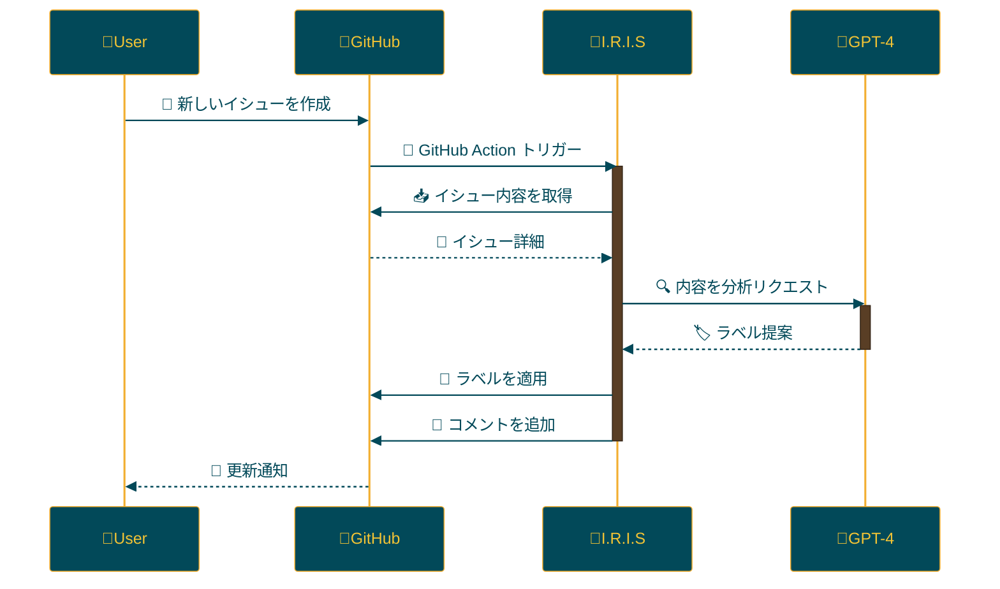

<p align="center">

<br>
<h1 align="center">IRIS</h1>
<h2 align="center">
  ～ Intelligent Repository Issue Solver ～
<br>

<a href="https://github.com/Sunwood-ai-labs/IRIS" title="Go to GitHub repo"></a>

<a href="https://github.com/Sunwood-ai-labs/IRIS"></a>
<a href="https://github.com/Sunwood-ai-labs/IRIS"></a>
<a href="https://github.com/Sunwood-ai-labs/IRIS"></a>


<br>
<p align="center">
  <a href="https://hamaruki.com/"><b>[🌐 Website]</b></a> •
  <a href="https://github.com/Sunwood-ai-labs"><b>[🐱 GitHub]</b></a>
  <a href="https://x.com/hAru_mAki_ch"><b>[🐦 Twitter]</b></a> •
  <a href="https://hamaruki.com/"><b>[🍀 Official Blog]</b></a>
</p>

</h2>

</p>

>[!IMPORTANT]
>このリポジトリのリリースノートやREADME、コミットメッセージの9割近くは[claude.ai](https://claude.ai/)や[ChatGPT4](https://chatgpt.com/)を活用した[AIRA](https://github.com/Sunwood-ai-labs/AIRA), [SourceSage](https://github.com/Sunwood-ai-labs/SourceSage), [Gaiah](https://github.com/Sunwood-ai-labs/Gaiah), [HarmonAI_II](https://github.com/Sunwood-ai-labs/HarmonAI_II)で生成しています。


## 🌟 はじめに

I.R.I.S（Intelligent Repository Issue Solver）は、GitHubリポジトリのイシュー管理を劇的に向上させるインテリジェントアシスタントです。機械学習と自然言語処理を活用し、イシューの自動分類、優先順位付け、解決策の提案を行います。

## 🚀 機能

- イシューの自動ラベリング
- OpenAI GPT-4を使用したイシュー分析
- GitHubアクションを通じた自動化プロセス

## 📁 リポジトリ構造

```
IRIS/
├─ .github/
│  ├─ disabled-workflows/
│  ├─ scripts/
│  │  └─ process_issue.py
│  └─ workflows/
│     └─ issue-review.yml
├─ docs/
│  └─ .sourcesage_releasenotes.yml
├─ issue_creator.log
└─ README.md
```

## 🛠️ インストールと設定

1. このリポジトリをクローンまたはフォークします。
2. `.github/workflows/issue-review.yml`ファイルをあなたのリポジトリの`.github/workflows/`ディレクトリにコピーします。
3. GitHub SecretsにOpenAI APIキー（`OPENAI_API_KEY`）とGitHubアクセストークン（`GH_ACCESS_TOKEN`）を設定します。

## 🔧 使用方法

I.R.I.Sは新しいイシューが作成されると自動的に起動します。以下のプロセスが実行されます：

1. イシューの内容を分析
2. 適切なラベルを提案
3. 提案されたラベルをイシューに適用
4. ラベリング結果をコメントとして追加

## 📝 更新情報

- [v0.1.0: 初期リリース](https://github.com/Sunwood-ai-labs/IRIS/releases/tag/v0.1.0): イシュー自動ラベリング機能の実装

## 🔄 ワークフロー

I.R.I.Sは以下のワークフローを使用しています：



## 🧪 開発用コマンド

AIRAを使用してコミットメッセージを生成：
```bash
aira --mode=commit --config=.aira\config.IRIS.yml
```

SourceSageを使用してリリースノートを生成：
```bash
sourcesage --yaml-file=docs\.sourcesage_releasenotes.yml
```

## 🤝 コントリビューション

プロジェクトへの貢献を歓迎します！以下の方法で貢献できます：

1. イシューを作成して改善点や問題点を報告
2. 新機能の提案
3. プルリクエストを送信してコードを改善

## 📄 ライセンス

このプロジェクトは[MITライセンス](LICENSE)の下で公開されています。

## 🙏 謝辞

- OpenAI - GPT-4の提供
- GitHub - アクションと開発プラットフォームの提供
- すべてのコントリビューターとユーザーの皆様