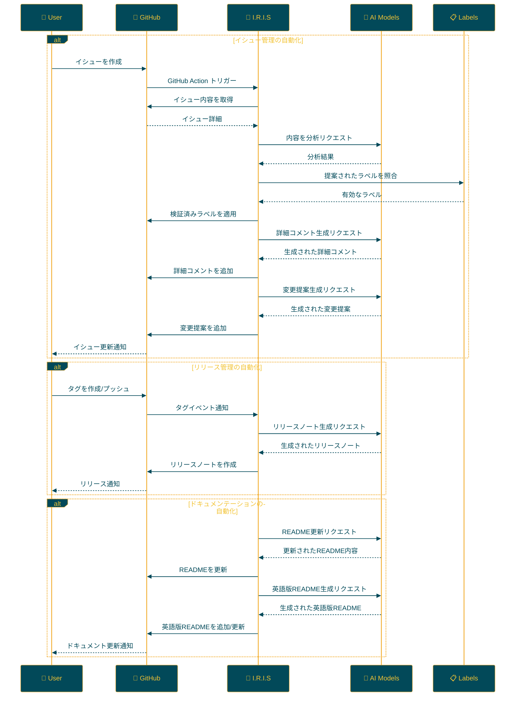

<p align="center">

<br>
<h1 align="center">IRIS</h1>
<h2 align="center">
  ～ Intelligent Repository Issue Solver ～
<br>

<a href="https://github.com/Sunwood-ai-labs/IRIS" title="Go to GitHub repo"></a>

<a href="https://github.com/Sunwood-ai-labs/IRIS"></a>
<a href="https://github.com/Sunwood-ai-labs/IRIS"></a>
<a href="https://github.com/Sunwood-ai-labs/IRIS"></a>


<br>
  


<br>
<p align="center">
  <a href="https://hamaruki.com/"><b>[🌐 Website]</b></a> •
  <a href="https://github.com/Sunwood-ai-labs"><b>[🐱 GitHub]</b></a>
  <a href="https://x.com/hAru_mAki_ch"><b>[🐦 Twitter]</b></a> •
  <a href="https://hamaruki.com/"><b>[🍀 Official Blog]</b></a>
</p>
   <br>

   <a href="https://github.com/Sunwood-ai-labs/aws-terraform-sandbox/blob/main/README.md"></a>
   <a href="https://github.com/Sunwood-ai-labs/aws-terraform-sandbox/blob/main/docs/README.en.md"></a>
</h2>

</p>

>[!IMPORTANT]
>このリポジトリのリリースノートやREADME、コミットメッセージの9割近くは[claude.ai](https://claude.ai/)や[ChatGPT4](https://chatgpt.com/)を活用した[AIRA](https://github.com/Sunwood-ai-labs/AIRA), [SourceSage](https://github.com/Sunwood-ai-labs/SourceSage), [Gaiah](https://github.com/Sunwood-ai-labs/Gaiah), [HarmonAI_II](https://github.com/Sunwood-ai-labs/HarmonAI_II)で生成しています。

## 🌟 はじめに

I.R.I.S（Intelligent Repository Issue Solver）は、GitHubリポジトリのイシュー管理を劇的に向上させるインテリジェントアシスタントです。機械学習と自然言語処理を活用し、イシューの自動分類、優先順位付け、解決策の提案を行います。

初めての方でも簡単に使い始められるよう、以下では詳しい説明と手順を記載しています。

## 🚀 主要機能

IRISは以下の3つの主要な自動化領域で強力な機能を提供します：

### 1. イシュー管理の自動化 🏷️

- **インテリジェントな自動ラベリング**：
  - 新規イシューの内容をAIが分析し、適切なラベルを自動付与
  - Google Gemini AIなどの高度な自然言語処理モデルを活用
  - プロジェクト固有のラベルをCSVファイルで簡単に定義・管理

- **詳細なイシュー分析と対応**：
  - イシューに対する深い洞察を含む詳細コメントを自動生成
  - 具体的な変更提案を作成し、プルリクエスト作成をサポート

### 2. リリース管理の効率化 📦

- **自動リリースノート生成**：
  - タグ付与時に対応するリリースノートを自動作成
  - プロジェクトの進捗と変更点を簡潔かつ正確に記録

### 3. ドキュメンテーションの自動更新 📝

- **READMEの自動メンテナンス**：
  - 新リリース情報を自動的にREADMEに反映
  - 最新の機能や変更点を常にドキュメントに反映

- **多言語サポート**：
  - 日本語READMEの更新に合わせて英語版READMEを自動生成
  - プロジェクトの国際的な可視性と理解を促進

### 📊 その他の特長

- **24/7稼働**：GitHubアクションを活用し、人間の介入なしで常時運用
- **高度なカスタマイズ性**：プロジェクトの特性に合わせて各機能を柔軟に調整可能
- **継続的な学習と改善**：AIモデルの定期的な更新により、パフォーマンスが常に向上

IRISを導入することで、開発チームはコア開発業務に集中でき、プロジェクト管理の効率が大幅に向上します。

## 📁 リポジトリ構造

```bash
IRIS/
├─ .github/
│  ├─ scripts/
│  │  ├─ deep_comment.py
│  │  ├─ suggest_changes.py
│  │  ├─ label_adder.py
│  │  └─ generate_github_release_notes.py
│  ├─ workflows/
│  │  ├─ issue-deep-comment.yml
│  │  ├─ issue-review.yml
│  │  └─ generate-release-notes.yml
│  ├─ services/
│  │  └─ github_service.py
│  └─ config.py
├─ docs/
│  └─ .sourcesage_releasenotes.yml
└─ README.md
```

## 🛠️ セットアップ方法

IRISは以下の2つの方法でセットアップできます：

1. **iris-coonコマンドを使用する方法**

   IRISをセットアップする最も簡単な方法は、`iris-coon`コマンドを使用することです。以下のコマンドでインストールとセットアップができます：

   ```bash
   pip install iris-coon
   iris-coon
   ```

   このコマンドを実行すると、必要なファイルとフォルダが現在のディレクトリにコピーされます。

2. **手動で.githubフォルダをコピーする方法**

   IRISの機能を既存のプロジェクトに追加したい場合は、以下の手順で.githubフォルダを直接コピーできます：

   ```bash
   git clone https://github.com/Sunwood-ai-labs/IRIS.git
   cp -r IRIS/.github /path/to/your/project/
   ```

   この方法では、IRISの.githubフォルダとその内容が、指定したプロジェクトディレクトリにコピーされます。必要に応じて、コピーしたファイルを編集してプロジェクトに合わせてカスタマイズできます。

### 🔐 GitHubシークレットの設定

IRISを正常に機能させるためには、以下のGitHubシークレットを設定する必要があります。これはどちらのセットアップ方法を選択した場合も必要な手順です。

#### 設定手順：

1. GitHubリポジトリページの「Settings」タブを開く
2. 左側メニューから「Secrets and variables」→「Actions」を選択
3. 「New repository secret」ボタンをクリック

#### 必要なシークレット：

| シークレット名 | 説明 | 用途 |
|--------------|------|-----|
| `GITHUB_TOKEN` | GitHubのパーソナルアクセストークン | リポジトリへのアクセス権限 |
| `GEMINI_API_KEY` | Google AI StudioのAPIキー | AI機能の利用 |
| `YOUR_PERSONAL_ACCESS_TOKEN` | GitHubパーソナルアクセストークン | リポジトリへの書き込み権限 |
| `YOUR_PERSONAL_ACCESS_TOKEN_IRIS` | IRIS専用のアクセストークン | IRIS固有の操作権限 |

> [!WARNING]
> これらのキーの取得方法については、各サービスの公式ドキュメントを参照するか、必要に応じて開発者にお問い合わせください。

#### セキュリティに関する重要な注意事項：

- これらのトークンは極めて重要な認証情報です。安全に管理し、決して公開リポジトリに直接記載しないでください。
- 定期的にトークンをローテーション（更新）することをお勧めします。
- 各トークンに必要最小限の権限のみを付与し、原則of最小権限を守ってください。

### 💻 Pythonライブラリとしての使用

IRISをPythonライブラリとして使用したい場合は、`example/demo.py`ファイルを参考にしてください。このデモファイルには、IRISの主要な機能を使用する方法が示されています。

例えば：

```python
from iris_coon import IrisCoon

# IRISのセットアップ
coon = IrisCoon(target_dir="path/to/your/project", force=True)
coon.run()
```

詳細な使用方法と高度な設定については、`example/demo.py`ファイルを確認してください。

## 🔧 使用方法

IRISをセットアップすると、以下の自動化された機能が利用可能になります：

1. **イシュー管理の自動化**:
   - 新しいイシューが作成されると、IRISが自動的に起動します。
   - AIがイシューの内容を分析し、適切なラベルを提案・適用します。
   - イシューに詳細なコメントが自動追加されます。
   - 必要に応じて、コードの変更提案が生成されます。

2. **リリース管理の自動化**:
   - タグが付与されると、そのタグに対応する自動リリースノートが生成されます。
   - 新しいリリースが発生すると、READMEが自動更新されます。

3. **ドキュメンテーションの自動化**:
   - READMEが更新されると、自動的に英語版README（`README.en.md`）が生成されます。

### 🏷️ タグによる自動リリースノート生成

新しいバージョンをリリースする準備ができたら、以下のようにタグを付けるだけです：

```bash
git tag v1.0.0
git push origin v1.0.0
```

これにより、`v1.0.0`に対応する詳細なリリースノートが自動的に生成されます。

### 📝 READMEの自動更新と翻訳

1. リリースノートが生成されると、IRISはREADMEを自動更新し、新機能や重要な変更点を反映します。

2. その後、更新されたREADMEの内容に基づいて、英語版の`README.en.md`が自動生成されます。

### 🔄 継続的な改善

これらの自動化プロセスにより、以下のメリットが得られます：

- プロジェクトドキュメントが常に最新状態に保たれます。
- 開発者の作業負荷が大幅に軽減されます。
- 国際的なユーザーへのアクセシビリティが向上します。

IRISを導入することで、開発チームはコア機能の開発により多くの時間を割くことができ、プロジェクト管理の効率が大幅に向上します。

## 🛠️ IrisCoon コマンドオプション

`iris-coon` コマンドは、以下のオプションをサポートしています：

| オプション | 短縮形 | 説明 | デフォルト値 |
|-----------|-------|------|-------------|
| `--target` | `-t` | ファイルをコピーするターゲットディレクトリ | 現在の作業ディレクトリ |
| `--force` | `-f` | 既存のファイルを強制的に上書き | `False` |
| `--exclude` | `-e` | コピーから除外するファイルのリスト | `["publish-to-pypi.yml"]` |

### 使用例：

1. デフォルト設定でIRISをセットアップ：
   ```
   iris-coon
   ```

2. 特定のディレクトリにIRISをセットアップ：
   ```
   iris-coon --target /path/to/your/project
   ```

3. 強制的に既存ファイルを上書きしてセットアップ：
   ```
   iris-coon -f
   ```

4. 特定のファイルを除外してセットアップ：
   ```
   iris-coon --exclude config.yml secrets.yml
   ```

5. 複数のオプションを組み合わせて使用：
   ```
   iris-coon -t /path/to/project -f --exclude config.yml
   ```

> [!WARNING]
>  `--force` オプションを使用する際は、既存のファイルが上書きされる可能性があるため注意してください。


## 📝 更新情報

- **[v0.6.0](https://github.com/Sunwood-ai-labs/IRIS/releases/tag/v0.6.0):** Iris Coonパッケージの導入: IRISリポジトリをクローンし、.githubフォルダをコピーする機能を提供する新しいパッケージです。 
- **[v0.5.5](https://github.com/Sunwood-ai-labs/IRIS/releases/tag/v0.5.5):** README自動更新処理の改善、英語READMEの更新、ヘッダー画像の更新。 
- [v0.5.4](https://github.com/Sunwood-ai-labs/IRIS/releases/tag/v0.5.4): 英語READMEの更新、SourceSageの設定ファイルのバージョン情報の更新、不要なREADMEの記述の削除、README自動更新機能の改善、いくつかのコード変更。 
- [v0.5.3](https://github.com/Sunwood-ai-labs/IRIS/releases/tag/v0.5.3): READMEの自動更新、タグ付与によるリリースノート作成、英語README作成など、新機能と改善点が追加されました。
- [v0.5.1](https://github.com/Sunwood-ai-labs/IRIS/releases/tag/v0.5.1): ドキュメントと構造を改善し、ユーザーエクスペリエンスを向上させました。
- [v0.5.0](https://github.com/Sunwood-ai-labs/IRIS/releases/tag/v0.5.0): リリースノートの自動生成、READMEの自動更新、ヘッダー画像の生成など、新たな機能が追加されました。
- [v0.4.0](https://github.com/Sunwood-ai-labs/IRIS/releases/tag/v0.4.0): 自動リリースノート生成機能の追加(実験的機能)、GitHub Serviceの改善
- [v0.3.0](https://github.com/Sunwood-ai-labs/IRIS/releases/tag/v0.3.0): 詳細コメント生成機能、変更提案機能の追加
- [v0.2.0](https://github.com/Sunwood-ai-labs/IRIS/releases/tag/v0.2.0): Google Generative AI統合、ラベル管理システムの改善、ユーザビリティの向上
- [v0.1.0](https://github.com/Sunwood-ai-labs/IRIS/releases/tag/v0.1.0): イシュー自動ラベリング機能の実装

## 🔄 ワークフロー

IRISの動作フローを以下の図で説明します：



## 🧪 開発用コマンド（上級者向け）

IRISの開発に携わる方向けのコマンドです：

AIRAを使用してコミットメッセージを生成：
```bash
aira --mode sourcesage commit  --config=.aira\config.dev.commit.yml --ss-model-name="gemini/gemini-1.5-pro-latest" --llm-output="llm_output.md"
```

SourceSageを使用してリリースノートを生成：
```bash
sourcesage --ss-mode=DocuMind --yaml-file=docs\.sourcesage_releasenotes.yml
```

## 🤝 コントリビューション

プロジェクトへの貢献を歓迎します！以下の方法で貢献できます：

1. イシューを作成して改善点や問題点を報告
2. 新機能の提案
3. プルリクエストを送信してコードを改善

初めての方は、[First Contributions](https://github.com/firstcontributions/first-contributions) のガイドを参考にしてみてください。

## 📄 ライセンス

このプロジェクトは[MITライセンス](LICENSE)の下で公開されています。使用、複製、変更、配布の際はライセンス条項をご確認ください。


## 🙏 謝辞

- Google - Gemini AIの提供
- GitHub - アクションと開発プラットフォームの提供
- すべてのコントリビューターとユーザーの皆様

## ❓ ヘルプとサポート

質問やサポートが必要な場合は、以下の方法でお問い合わせください：

1. [GitHubのIssues](https://github.com/Sunwood-ai-labs/IRIS/issues)ページで新しいイシューを作成
2. [公式ウェブサイト](https://hamaruki.com/)のお問い合わせフォームを利用
3. [Twitter](https://x.com/hAru_mAki_ch)でダイレクトメッセージを送信

初心者の方も気軽にお問い合わせください。皆様のフィードバックをお待ちしています！
