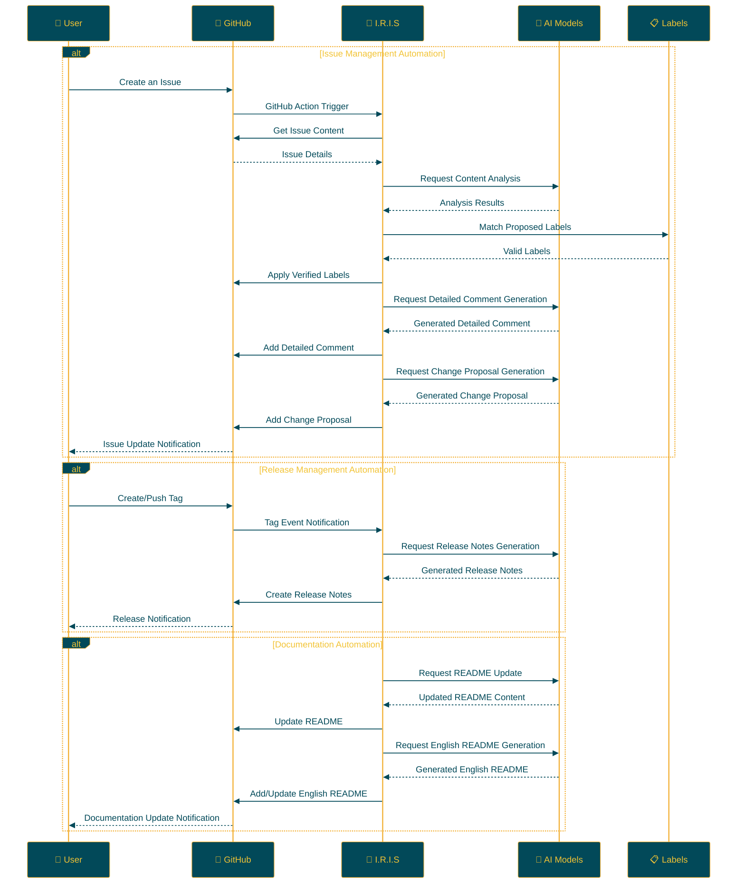

## IRIS: Intelligent Repository Issue Solver

<p align="center">

<br>
<h1 align="center">IRIS</h1>
<h2 align="center">
  ～ Intelligent Repository Issue Solver ～
<br>

<a href="https://github.com/Sunwood-ai-labs/IRIS" title="Go to GitHub repo"></a>

<a href="https://github.com/Sunwood-ai-labs/IRIS"></a>
<a href="https://github.com/Sunwood-ai-labs/IRIS"></a>
<a href="https://github.com/Sunwood-ai-labs/IRIS"></a>


<br>
  


<br>
<p align="center">
  <a href="https://hamaruki.com/"><b>[🌐 Website]</b></a> •
  <a href="https://github.com/Sunwood-ai-labs"><b>[🐱 GitHub]</b></a>
  <a href="https://x.com/hAru_mAki_ch"><b>[🐦 Twitter]</b></a> •
  <a href="https://hamaruki.com/"><b>[🍀 Official Blog]</b></a>
</p>
   <br>

   <a href="https://github.com/Sunwood-ai-labs/IRIS/blob/main/README.md"></a>
   <a href="https://github.com/Sunwood-ai-labs/IRIS/blob/main/docs/README.en.md"></a>
</h2>

</p>

>[!IMPORTANT]
>This repository's release notes, README, and commit messages are primarily generated using [claude.ai](https://claude.ai/), [ChatGPT4](https://chatgpt.com/), and tools like [AIRA](https://github.com/Sunwood-ai-labs/AIRA), [SourceSage](https://github.com/Sunwood-ai-labs/SourceSage), [Gaiah](https://github.com/Sunwood-ai-labs/Gaiah), and [HarmonAI_II](https://github.com/Sunwood-ai-labs/HarmonAI_II).

## 🌟 Introduction

IRIS (Intelligent Repository Issue Solver) is an intelligent assistant that revolutionizes GitHub repository issue management. Leveraging machine learning and natural language processing, it automates issue classification, prioritization, and solution suggestion.

This document provides a detailed explanation and setup instructions to help you get started with IRIS.

## 🚀 Key Features

IRIS offers powerful features across three core automation areas:

### 1. Issue Management Automation 🏷️

- **Intelligent Automatic Labeling:**
  - AI analyzes new issue content and automatically assigns appropriate labels.
  - Utilizes advanced natural language processing models like Google Gemini AI.
  - Easily define and manage project-specific labels via CSV files.

- **Detailed Issue Analysis and Responses:**
  - Automatically generates detailed comments that include deep insights on issues.
  - Creates concrete change proposals and supports pull request creation.

### 2. Release Management Optimization 📦

- **Automatic Release Notes Generation:**
  - Automatically generates release notes corresponding to tagged releases.
  - Concisely and accurately records project progress and changes.

### 3. Documentation Auto-Update 📝

- **README Automatic Maintenance:**
  - Reflects new release information automatically in the README.
  - Ensures that the documentation always reflects the latest features and changes.

- **Multilingual Support:**
  - Automatically generates English README (`README.en.md`) based on Japanese README updates.
  - Promotes international visibility and understanding of the project.

### 📊 Other Features

- **24/7 Operation:** Continuous operation using GitHub Actions, eliminating human intervention.
- **High Customization:** Flexible adjustment of each feature to match project characteristics.
- **Continuous Learning and Improvement:** Regular updates to the AI model ensure continuous performance improvement.

Adopting IRIS empowers development teams to focus on core development tasks, leading to significant efficiency improvements in project management.

## 📁 Repository Structure

```bash
IRIS/
├─ .github/
│  ├─ scripts/
│  │  ├─ deep_comment.py
│  │  ├─ suggest_changes.py
│  │  ├─ label_adder.py
│  │  └─ generate_github_release_notes.py
│  ├─ workflows/
│  │  ├─ issue-deep-comment.yml
│  │  ├─ issue-review.yml
│  │  └─ generate-release-notes.yml
│  ├─ services/
│  │  └─ github_service.py
│  └─ config.py
├─ docs/
│  └─ .sourcesage_releasenotes.yml
└─ README.md
```

## 🛠️ Setup

IRIS can be set up in two ways:

1. **Using the `iris-coon` Command**

   The easiest way to set up IRIS is using the `iris-coon` command. The following commands install and set up IRIS:

   ```bash
   pip install iris-coon
   iris-coon
   ```

   This command will copy the necessary files and folders to the current directory.

2. **Manually Copying the `.github` Folder**

   If you want to add IRIS functionality to an existing project, you can directly copy the `.github` folder using the following steps:

   ```bash
   git clone https://github.com/Sunwood-ai-labs/IRIS.git
   cp -r IRIS/.github /path/to/your/project/
   ```

   This method copies the IRIS `.github` folder and its contents to the specified project directory. You can edit the copied files to customize them for your project.

### 🔐 GitHub Secrets Configuration

To ensure IRIS functions correctly, you must configure the following GitHub Secrets. This is a necessary step regardless of which setup method you choose.

#### Configuration Steps:

1. Open the "Settings" tab on your GitHub repository page.
2. Select "Secrets and variables" → "Actions" from the left menu.
3. Click the "New repository secret" button.

#### Required Secrets:

| Secret Name | Description | Purpose |
|--------------|------|-----|
| `GITHUB_TOKEN` | GitHub personal access token | Access permissions to the repository |
| `GEMINI_API_KEY` | Google AI Studio API key | Utilizing AI features |
| `YOUR_PERSONAL_ACCESS_TOKEN` | GitHub personal access token | Write permissions to the repository |
| `YOUR_PERSONAL_ACCESS_TOKEN_IRIS` | IRIS-specific access token | IRIS-specific operational permissions |

> [!WARNING]
> Consult the official documentation for each service for instructions on obtaining these keys, or contact the developers if needed.

#### Important Security Considerations:

- These tokens are extremely sensitive credentials. Manage them securely and never include them directly in public repositories.
- Regularly rotate (update) tokens.
- Grant only the minimum required permissions to each token, adhering to the principle of least privilege.

### 💻 Python Library Usage

If you wish to use IRIS as a Python library, refer to the `example/demo.py` file. This demo file demonstrates how to use the core features of IRIS.

For example:

```python
from iris_coon import IrisCoon

# Set up IRIS
coon = IrisCoon(target_dir="path/to/your/project", force=True)
coon.run()
```

Consult the `example/demo.py` file for detailed usage instructions and advanced configurations.

## 🔧 Usage

Once you set up IRIS, the following automated features become available:

1. **Issue Management Automation:**
   - When a new issue is created, IRIS automatically starts.
   - AI analyzes the issue content and suggests/applies appropriate labels.
   - Detailed comments are automatically added to the issue.
   - Code change suggestions are generated when necessary.

2. **Release Management Automation:**
   - When a tag is applied, an automatic release note corresponding to that tag is generated.
   - The README is automatically updated when a new release occurs.

3. **Documentation Automation:**
   - When the README is updated, an English version (`README.en.md`) is automatically generated.

### 🏷️ Tag-Based Automatic Release Note Generation

When ready to release a new version, simply tag it as follows:

```bash
git tag v1.0.0
git push origin v1.0.0
```

This will automatically generate detailed release notes corresponding to `v1.0.0`.

### 📝 README Auto-Update and Translation

1. After release notes are generated, IRIS automatically updates the README to reflect new features and important changes.

2. Based on the updated README content, an English version of `README.en.md` is automatically generated.

### 🔄 Continuous Improvement

These automation processes provide the following benefits:

- Project documentation is always up-to-date.
- Developer workload is significantly reduced.
- Accessibility for international users is enhanced.

By adopting IRIS, development teams can dedicate more time to core feature development, leading to significant improvements in project management efficiency.

## 🛠️ IrisCoon Command Options

The `iris-coon` command supports the following options:

| Option | Short Form | Description | Default Value |
|-----------|-------|------|-------------|
| `--target` | `-t` | Target directory to copy files | Current working directory |
| `--force` | `-f` | Force overwrite existing files | `False` |
| `--exclude` | `-e` | List of files to exclude from copying | `["publish-to-pypi.yml"]` |

### Usage Examples:

1. Set up IRIS with default settings:
   ```
   iris-coon
   ```

2. Set up IRIS in a specific directory:
   ```
   iris-coon --target /path/to/your/project
   ```

3. Set up IRIS with force overwriting existing files:
   ```
   iris-coon -f
   ```

4. Set up IRIS excluding specific files:
   ```
   iris-coon --exclude config.yml secrets.yml
   ```

5. Combine multiple options:
   ```
   iris-coon -t /path/to/project -f --exclude config.yml
   ```

> [!WARNING]
> Exercise caution when using the `--force` option as existing files may be overwritten.


## 📝 Update Information

- **[v0.6.0](https://github.com/Sunwood-ai-labs/IRIS/releases/tag/v0.6.0):** Introduction of the Iris Coon package: A new package providing functionality to clone the IRIS repository and copy the `.github` folder. 
- **[v0.5.5](https://github.com/Sunwood-ai-labs/IRIS/releases/tag/v0.5.5):** Improved README auto-update process, updated English README, updated header image. 
- [v0.5.4](https://github.com/Sunwood-ai-labs/IRIS/releases/tag/v0.5.4): Updated English README, updated version information in SourceSage configuration files, removed unnecessary README descriptions, improved README auto-update functionality, and made some code changes. 
- [v0.5.3](https://github.com/Sunwood-ai-labs/IRIS/releases/tag/v0.5.3): Added new features and improvements, including automatic README updates, release notes generation upon tagging, and English README creation.
- [v0.5.1](https://github.com/Sunwood-ai-labs/IRIS/releases/tag/v0.5.1): Improved documentation and structure for enhanced user experience.
- [v0.5.0](https://github.com/Sunwood-ai-labs/IRIS/releases/tag/v0.5.0): Added new features such as automatic release notes generation, automatic README updates, and header image generation.
- [v0.4.0](https://github.com/Sunwood-ai-labs/IRIS/releases/tag/v0.4.0): Added automatic release notes generation functionality (experimental feature), improved GitHub Service
- [v0.3.0](https://github.com/Sunwood-ai-labs/IRIS/releases/tag/v0.3.0): Added detailed comment generation functionality, change proposal functionality
- [v0.2.0](https://github.com/Sunwood-ai-labs/IRIS/releases/tag/v0.2.0): Google Generative AI integration, improved label management system, enhanced usability
- [v0.1.0](https://github.com/Sunwood-ai-labs/IRIS/releases/tag/v0.1.0): Implemented automatic issue labeling functionality

## 🔄 Workflow

The following diagram illustrates the operational flow of IRIS:



## 🧪 Development Commands (Advanced Users)

These commands are intended for individuals involved in developing IRIS:

Generate commit messages using AIRA:
```bash
aira --mode sourcesage commit  --config=.aira\config.dev.commit.yml --ss-model-name="gemini/gemini-1.5-pro-latest" --llm-output="llm_output.md"
```

Generate release notes using SourceSage:
```bash
sourcesage --ss-mode=DocuMind --yaml-file=docs\.sourcesage_releasenotes.yml
```

## 🤝 Contributions

Contributions to the project are welcome! You can contribute in the following ways:

1. Create an issue to report improvements or problems.
2. Suggest new features.
3. Submit a pull request to improve the code.

For beginners, consider referring to the [First Contributions](https://github.com/firstcontributions/first-contributions) guide.

## 📄 License

This project is licensed under the [MIT License](LICENSE). Please review the license terms for usage, reproduction, modification, and distribution.


## 🙏 Acknowledgments

- Google - for providing Gemini AI
- GitHub - for providing Actions and the development platform
- All contributors and users

## ❓ Help and Support

If you have questions or need support, please contact us using the following methods:

1. Create a new issue on the [GitHub Issues](https://github.com/Sunwood-ai-labs/IRIS/issues) page.
2. Use the contact form on the [official website](https://hamaruki.com/).
3. Send a direct message on [Twitter](https://x.com/hAru_mAki_ch).

Don't hesitate to contact us, even if you're a beginner. We appreciate your feedback!