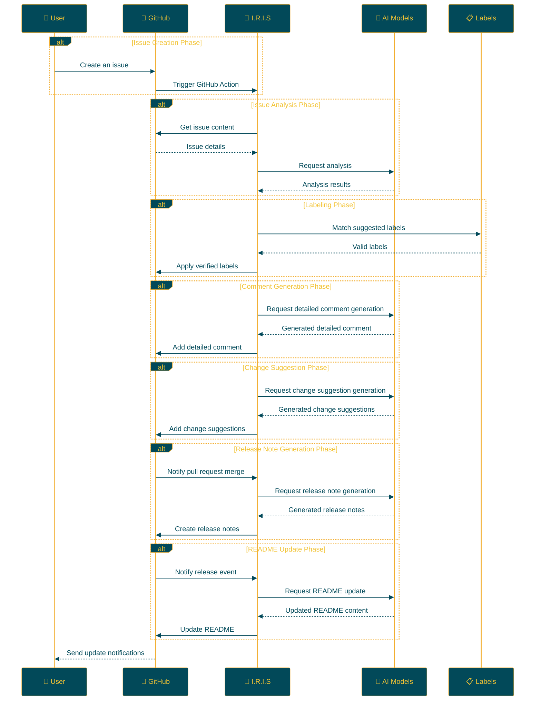

## IRIS: Intelligent Repository Issue Solver

<p align="center">

<br>
<h1 align="center">IRIS</h1>
<h2 align="center">
  ～ Intelligent Repository Issue Solver ～
<br>

<a href="https://github.com/Sunwood-ai-labs/IRIS" title="Go to GitHub repo"></a>

<a href="https://github.com/Sunwood-ai-labs/IRIS"></a>
<a href="https://github.com/Sunwood-ai-labs/IRIS"></a>
<a href="https://github.com/Sunwood-ai-labs/IRIS"></a>


<br>
<p align="center">
  <a href="https://hamaruki.com/"><b>[🌐 Website]</b></a> •
  <a href="https://github.com/Sunwood-ai-labs"><b>[🐱 GitHub]</b></a>
  <a href="https://x.com/hAru_mAki_ch"><b>[🐦 Twitter]</b></a> •
  <a href="https://hamaruki.com/"><b>[🍀 Official Blog]</b></a>
</p>

</h2>

</p>

>[!IMPORTANT]
>This repository's release notes, README, and nearly 90% of commit messages are generated using [claude.ai](https://claude.ai/), [ChatGPT4](https://chatgpt.com/), and tools like [AIRA](https://github.com/Sunwood-ai-labs/AIRA), [SourceSage](https://github.com/Sunwood-ai-labs/SourceSage), [Gaiah](https://github.com/Sunwood-ai-labs/Gaiah), and [HarmonAI_II](https://github.com/Sunwood-ai-labs/HarmonAI_II).

## 🌟 Introduction

I.R.I.S (Intelligent Repository Issue Solver) is an intelligent assistant designed to dramatically improve issue management in your GitHub repositories. Leveraging machine learning and natural language processing, it automates issue classification, prioritization, and solution suggestion.

This README provides a detailed explanation and step-by-step instructions for setting up and using IRIS, making it easy for even beginners to get started.

## 🚀 Features

- **Automatic Issue Labeling**: When a new issue is created, AI analyzes its content and automatically assigns appropriate labels.
- **Multi-AI Model Issue Analysis**: IRIS utilizes advanced natural language processing models like Google Gemini AI for a deeper understanding of issue content.
- **Automated Processes through GitHub Actions**: Operates 24/7 without human intervention.
- **Customizable Label Management**: Easily define and manage project-specific labels through CSV files.
- **Detailed Comment Generation**: Automates the generation of insightful comments providing deeper context for issues.
- **Change Suggestions**: Generates specific change proposals based on issues, supporting pull request creation.
- **Automatic Release Note Generation**:  Generates release notes automatically when pull requests are merged.
- **README Auto-Update**: Updates the README with release note content upon new releases.
- **Automatic Release Note Creation on Tagging**:  Creates release notes corresponding to tags automatically when they are added.

## 📁 Repository Structure

```bash
IRIS/
├─ .github/
│  ├─ scripts/
│  │  ├─ deep_comment.py
│  │  ├─ suggest_changes.py
│  │  ├─ label_adder.py
│  │  └─ generate_github_release_notes.py
│  ├─ workflows/
│  │  ├─ issue-deep-comment.yml
│  │  ├─ issue-review.yml
│  │  └─ generate-release-notes.yml
│  ├─ services/
│  │  └─ github_service.py
│  └─ config.py
├─ docs/
│  └─ .sourcesage_releasenotes.yml
└─ README.md
```

## 🛠️ Installation and Configuration (Beginner-Friendly Step-by-Step Guide)

1. **Clone the Repository**:
   - If you don't have a GitHub account, register one first: [GitHub Signup](https://github.com/join).
   - Visit the [IRIS repository](https://github.com/Sunwood-ai-labs/IRIS) and click the green "Code" button.
   - Select "Download ZIP" to download the files and unzip them.

2. **Copy Workflow Files**:
   - Locate all the YAML files within the `.github/workflows/` directory inside the unzipped folder.
   - Copy these files to the `.github/workflows/` directory of your GitHub repository.
     (Create the `.github/workflows/` directory if it doesn't exist)

3. **Set GitHub Secrets**:
   - Navigate to the "Settings" tab of your GitHub repository page.
   - Select "Secrets and variables" → "Actions" from the left menu.
   - Click the "New repository secret" button and add the following secrets:
     - `GITHUB_TOKEN`: Your GitHub personal access token.
     - `GEMINI_API_KEY`: Your Google AI Studio API key.
     - `YOUR_PERSONAL_ACCESS_TOKEN`: Your GitHub personal access token (must have write permission to the repository).
     - `YOUR_PERSONAL_ACCESS_TOKEN_IRIS`:  A dedicated personal access token for the IRIS system.
   - If you don't know how to obtain these keys, refer to the documentation of each service or consult the developers.

4. **Install Dependencies**:
   - Install the dependencies listed in the `requirements.txt` file.
   ```
   pip install -r requirements.txt
   ```

## 🔧 Usage

Once IRIS is set up, it operates as follows:

1. When a new issue is created in your repository, IRIS will automatically activate.
2. The AI analyzes the issue content.
3. Appropriate labels are suggested and automatically applied to the issue.
4. Detailed comments are added to the issue.
5. Change suggestions are generated if necessary.
6. When a pull request is merged, release notes are automatically generated.
7. Upon new releases, the README is automatically updated with the release notes content.

No special actions are required. Simply create a new issue, and IRIS will handle everything automatically.

## 📝 Updates

- [v0.5.1](https://github.com/Sunwood-ai-labs/IRIS/releases/tag/v0.5.1): Improved documentation, structure, and user experience.
- [v0.5.0](https://github.com/Sunwood-ai-labs/IRIS/releases/tag/v0.5.0): Added new features including automatic release note generation, README auto-update, and header image generation.
- [v0.4.0](https://github.com/Sunwood-ai-labs/IRIS/releases/tag/v0.4.0): Added automatic release note generation feature (experimental), improved GitHub Service.
- [v0.3.0](https://github.com/Sunwood-ai-labs/IRIS/releases/tag/v0.3.0): Added detailed comment generation and change suggestion features.
- [v0.2.0](https://github.com/Sunwood-ai-labs/IRIS/releases/tag/v0.2.0): Integrated Google Generative AI, improved label management system, enhanced usability.
- [v0.1.0](https://github.com/Sunwood-ai-labs/IRIS/releases/tag/v0.1.0): Implemented the automatic issue labeling feature.

## 🔄 Workflow

The following diagram illustrates the flow of operations for IRIS:



## 🧪 Development Commands (Advanced Users)

The following commands are for developers involved in IRIS development:

Generate commit messages using AIRA:
```bash
aira --mode sourcesage commit  --config=.aira\config.dev.commit.yml --ss-model-name="gemini/gemini-1.5-pro-latest" --llm-output="llm_output.md"
```

Generate release notes using SourceSage:
```bash
sourcesage --ss-mode=DocuMind --yaml-file=docs\.sourcesage_releasenotes.yml
```

## 🤝 Contributions

Contributions to the project are highly encouraged! You can contribute by:

1. Creating issues to report improvements or problems.
2. Suggesting new features.
3. Submitting pull requests to enhance the code.

For first-time contributors, check out the [First Contributions](https://github.com/firstcontributions/first-contributions) guide.

## 📄 License

This project is licensed under the [MIT License](LICENSE). Please refer to the license terms for usage, reproduction, modification, and distribution.

## 🙏 Acknowledgements

- Google - for providing Gemini AI
- GitHub - for providing Actions and the development platform
- All contributors and users.

## ❓ Help and Support

If you have questions or require support, please contact us through:

1. Creating a new issue on the [GitHub Issues](https://github.com/Sunwood-ai-labs/IRIS/issues) page.
2. Using the contact form on the [Official Website](https://hamaruki.com/).
3. Sending a direct message on [Twitter](https://x.com/hAru_mAki_ch).

Feel free to reach out even if you are a beginner. We welcome your feedback!