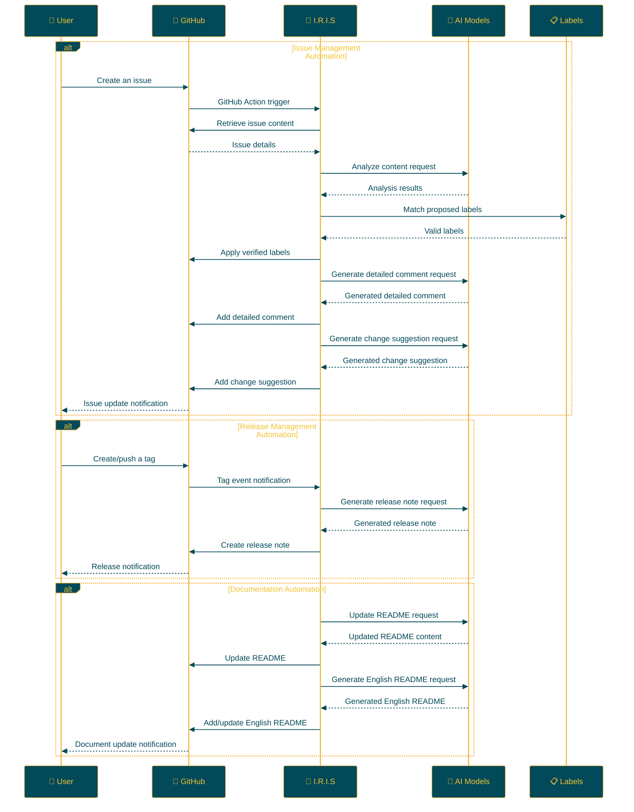

## IRIS: Intelligent Repository Issue Solver

<p align="center">

<br>
<h1 align="center">IRIS</h1>
<h2 align="center">
  ～ Intelligent Repository Issue Solver ～
<br>

<a href="https://github.com/Sunwood-ai-labs/IRIS" title="Go to GitHub repo"></a>

<a href="https://github.com/Sunwood-ai-labs/IRIS"></a>
<a href="https://github.com/Sunwood-ai-labs/IRIS"></a>
<a href="https://github.com/Sunwood-ai-labs/IRIS"></a>


<br>
  


<br>
<p align="center">
  <a href="https://hamaruki.com/"><b>[🌐 Website]</b></a> •
  <a href="https://github.com/Sunwood-ai-labs"><b>[🐱 GitHub]</b></a>
  <a href="https://x.com/hAru_mAki_ch"><b>[🐦 Twitter]</b></a> •
  <a href="https://hamaruki.com/"><b>[🍀 Official Blog]</b></a>
</p>
   <br>

   <a href="https://github.com/Sunwood-ai-labs/IRIS/blob/main/README.md"></a>
   <a href="https://github.com/Sunwood-ai-labs/IRIS/blob/main/docs/README.en.md"></a>
</h2>

</p>

>[!IMPORTANT]
>Nearly 90% of this repository's release notes, README, and commit messages are generated using [claude.ai](https://claude.ai/) and [ChatGPT4](https://chatgpt.com/) with the help of [AIRA](https://github.com/Sunwood-ai-labs/AIRA), [SourceSage](https://github.com/Sunwood-ai-labs/SourceSage), [Gaiah](https://github.com/Sunwood-ai-labs/Gaiah), and [HarmonAI_II](https://github.com/Sunwood-ai-labs/HarmonAI_II).

## 🌟 Introduction

IRIS (Intelligent Repository Issue Solver) is an intelligent assistant designed to dramatically improve GitHub repository issue management. Leveraging machine learning and natural language processing, it automates issue classification, prioritization, and solution suggestion.

This README provides detailed explanations and instructions to help you easily get started with IRIS.

## 🚀 Key Features

IRIS offers powerful capabilities across these three key automation areas:

### 1. Issue Management Automation 🏷️

- **Intelligent Auto-Labeling**:
  - AI analyzes new issues to automatically assign relevant labels.
  - Utilizes advanced natural language processing models like Google Gemini AI.
  - Easily define and manage project-specific labels using CSV files.

- **Detailed Issue Analysis and Response**:
  - Generates detailed comments with insightful analysis for issues.
  - Creates concrete change suggestions to support pull request creation.

### 2. Release Management Efficiency 📦

- **Automatic Release Note Generation**:
  - Creates release notes automatically upon tagging.
  - Records concise and accurate project progress and changes.

### 3. Documentation Auto-Updates 📝

- **README Auto-Maintenance**:
  - Automatically reflects new release information in the README.
  - Keeps the documentation updated with the latest features and changes.

- **Multi-Language Support**:
  - Automatically generates an English README alongside Japanese updates.
  - Promotes international project visibility and understanding.

### 📊 Additional Features

- **24/7 Operation**: Operates continuously using GitHub Actions without human intervention.
- **High Customization**: Flexible adjustment of each feature to suit project characteristics.
- **Continuous Learning and Improvement**: Regular model updates ensure ongoing performance enhancements.

By adopting IRIS, development teams can focus on core development tasks, significantly improving project management efficiency.

## 📁 Repository Structure

```bash
IRIS/
├─ .github/
│  ├─ scripts/
│  │  ├─ deep_comment.py
│  │  ├─ suggest_changes.py
│  │  ├─ label_adder.py
│  │  └─ generate_github_release_notes.py
│  ├─ workflows/
│  │  ├─ issue-deep-comment.yml
│  │  ├─ issue-review.yml
│  │  └─ generate-release-notes.yml
│  ├─ services/
│  │  └─ github_service.py
│  └─ config.py
├─ docs/
│  └─ .sourcesage_releasenotes.yml
└─ README.md
```

## 🛠️ Setup Methods

IRIS can be set up in two ways:

1. **Using the `iris-coon` Command**

   The easiest way to set up IRIS is using the `iris-coon` command.  Install and set it up using:

   ```bash
   pip install iris-coon
   iris-coon
   ```

   Running this command will copy the necessary files and folders into the current directory.

2. **Manually Copying the .github Folder**

   To add IRIS functionality to an existing project, copy the `.github` folder directly using the following steps:

   ```bash
   git clone https://github.com/Sunwood-ai-labs/IRIS.git
   cp -r IRIS/.github /path/to/your/project/
   ```

   This method copies IRIS's `.github` folder and its contents to the specified project directory. You can customize the copied files to match your project, if needed.

### 🔐 GitHub Secret Configuration

IRIS requires the configuration of the following GitHub secrets for proper functionality. This step is necessary regardless of the chosen setup method.

#### Configuration Steps:

1. Go to the "Settings" tab on your GitHub repository page.
2. Select "Secrets and variables" -> "Actions" from the left menu.
3. Click the "New repository secret" button.

#### Required Secrets:

| Secret Name        | Description | Usage |
|--------------------|-------------|-------|
| `GITHUB_TOKEN`      | GitHub Personal Access Token | Repository access permissions |
| `GEMINI_API_KEY`     | Google AI Studio API Key | AI feature utilization |
| `YOUR_PERSONAL_ACCESS_TOKEN` | GitHub Personal Access Token | Repository write permissions |
| `YOUR_PERSONAL_ACCESS_TOKEN_IRIS` | IRIS-specific Access Token | IRIS-specific operation permissions |

> [!WARNING]
> Refer to the official documentation of each service for instructions on obtaining these keys or contact the developers if needed.

#### Important Security Considerations:

- These tokens are highly sensitive credentials.  Manage them securely and never include them directly in public repositories.
- Regularly rotate (update) your tokens.
- Grant each token only the minimum required permissions, adhering to the principle of least privilege.

### 💻 Using as a Python Library

If you want to use IRIS as a Python library, refer to the `example/demo.py` file. This demo file demonstrates how to use IRIS's main features.

For example:

```python
from iris_coon import IrisCoon

# IRIS Setup
coon = IrisCoon(target_dir="path/to/your/project", force=True)
coon.run()
```

Refer to the `example/demo.py` file for detailed usage and advanced settings.

## 🔧 Usage

After setting up IRIS, the following automated features become available:

1. **Issue Management Automation**:
   - When a new issue is created, IRIS automatically activates.
   - AI analyzes the issue content and suggests/applies appropriate labels.
   - Detailed comments are automatically added to the issue.
   - If necessary, code change suggestions are generated.

2. **Release Management Automation**:
   - When a tag is applied, an automatic release note corresponding to that tag is generated.
   - When a new release occurs, the README is automatically updated.

3. **Documentation Automation**:
   - When the README is updated, an English README (`README.en.md`) is automatically generated.

### 🏷️ Automatic Release Note Generation with Tags

When you're ready to release a new version, simply tag it like this:

```bash
git tag v1.0.0
git push origin v1.0.0
```

This will automatically generate detailed release notes corresponding to `v1.0.0`.

### 📝 README Auto-Update and Translation

1. After the release notes are generated, IRIS automatically updates the README to reflect new features and important changes.

2. Subsequently, based on the updated README content, an English version (`README.en.md`) is automatically generated.

### 🔄 Continuous Improvement

These automation processes provide the following benefits:

- Project documentation is always kept up-to-date.
- Developer workload is significantly reduced.
- Accessibility for international users is enhanced.

By adopting IRIS, development teams can dedicate more time to core feature development, significantly improving project management efficiency.

## 🛠️ IrisCoon Command Options

The `iris-coon` command supports the following options:

| Option    | Short Form | Description | Default Value |
|-----------|------------|-------------|---------------|
| `--target` | `-t`      | Target directory to copy files to | Current working directory |
| `--force`  | `-f`      | Force overwriting existing files | `False` |
| `--exclude` | `-e`      | List of files to exclude from copying | `["publish-to-pypi.yml"]` |

### Usage Examples:

1. Set up IRIS with default settings:
   ```
   iris-coon
   ```

2. Set up IRIS in a specific directory:
   ```
   iris-coon --target /path/to/your/project
   ```

3. Set up with forced overwriting of existing files:
   ```
   iris-coon -f
   ```

4. Set up excluding specific files:
   ```
   iris-coon --exclude config.yml secrets.yml
   ```

5. Combine multiple options:
   ```
   iris-coon -t /path/to/project -f --exclude config.yml
   ```

> [!WARNING]
> When using the `--force` option, be careful as existing files may be overwritten.


## 📝 Update Information

- **[v0.6.1](https://github.com/Sunwood-ai-labs/IRIS/releases/tag/v0.6.1):** IRIS v0.6.1 is a minor release containing new features and improvements for further enhancing GitHub repository issue management. This release introduces a new package `iris-coon` for easier IRIS setup. 
- **[v0.6.0](https://github.com/Sunwood-ai-labs/IRIS/releases/tag/v0.6.0):** Introduction of the Iris Coon package: A new package providing functionality to clone the IRIS repository and copy the .github folder. 
- **[v0.5.5](https://github.com/Sunwood-ai-labs/IRIS/releases/tag/v0.5.5):** Improvements to README auto-update processing, English README updates, and header image updates. 
- [v0.5.4](https://github.com/Sunwood-ai-labs/IRIS/releases/tag/v0.5.4): English README updates, version information updates in the SourceSage configuration file, removal of unnecessary README descriptions, improvements to the README auto-update feature, and several code changes. 
- [v0.5.3](https://github.com/Sunwood-ai-labs/IRIS/releases/tag/v0.5.3): New features and improvements added, including README auto-update, release note creation through tagging, and English README creation. 
- [v0.5.1](https://github.com/Sunwood-ai-labs/IRIS/releases/tag/v0.5.1): Improved documentation and structure, enhancing user experience.
- [v0.5.0](https://github.com/Sunwood-ai-labs/IRIS/releases/tag/v0.5.0): New features added, including automatic release note generation, README auto-update, and header image generation. 
- [v0.4.0](https://github.com/Sunwood-ai-labs/IRIS/releases/tag/v0.4.0): Addition of automatic release note generation functionality (experimental feature), improvements to GitHub Service
- [v0.3.0](https://github.com/Sunwood-ai-labs/IRIS/releases/tag/v0.3.0): Added detailed comment generation functionality, change suggestion functionality
- [v0.2.0](https://github.com/Sunwood-ai-labs/IRIS/releases/tag/v0.2.0): Google Generative AI integration, label management system improvements, enhanced usability
- [v0.1.0](https://github.com/Sunwood-ai-labs/IRIS/releases/tag/v0.1.0): Implementation of automatic issue labeling functionality

## 🔄 Workflow

The IRIS operation flow is illustrated in the diagram below:



## 🧪 Development Commands (Advanced Users)

These commands are for those involved in IRIS development:

Generate commit messages using AIRA:
```bash
aira --mode sourcesage commit  --config=.aira\config.dev.commit.yml --ss-model-name="gemini/gemini-1.5-pro-latest" --llm-output="llm_output.md"
```

Generate release notes using SourceSage:
```bash
sourcesage --ss-mode=DocuMind --yaml-file=docs\.sourcesage_releasenotes.yml
```

## 🤝 Contributions

Contributions to the project are welcome! You can contribute in the following ways:

1. Create an issue to report improvements or problems.
2. Suggest new features.
3. Submit a pull request to improve the code.

For first-timers, check out the [First Contributions](https://github.com/firstcontributions/first-contributions) guide.

## 📄 License

This project is licensed under the [MIT License](LICENSE). Please review the license terms for usage, reproduction, modification, and distribution.


## 🙏 Acknowledgements

- Google - For providing Gemini AI
- GitHub - For providing actions and the development platform
- All contributors and users

## ❓ Help and Support

If you have questions or need support, please contact us using the following methods:

1. Create a new issue on the [GitHub Issues](https://github.com/Sunwood-ai-labs/IRIS/issues) page.
2. Use the contact form on the [official website](https://hamaruki.com/).
3. Send a direct message on [Twitter](https://x.com/hAru_mAki_ch).

Don't hesitate to contact us, even if you're a beginner. We look forward to your feedback!
</readme>
```