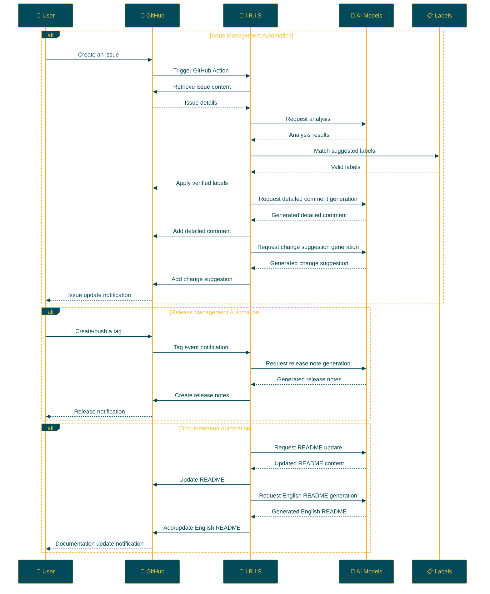

## IRIS: Intelligent Repository Issue Solver

<p align="center">

<br>
<h1 align="center">IRIS</h1>
<h2 align="center">
  ～ Intelligent Repository Issue Solver ～
<br>

<a href="https://github.com/Sunwood-ai-labs/IRIS" title="Go to GitHub repo"></a>

<a href="https://github.com/Sunwood-ai-labs/IRIS"></a>
<a href="https://github.com/Sunwood-ai-labs/IRIS"></a>
<a href="https://github.com/Sunwood-ai-labs/IRIS"></a>


<br>
  


<br>
<p align="center">
  <a href="https://hamaruki.com/"><b>[🌐 Website]</b></a> •
  <a href="https://github.com/Sunwood-ai-labs"><b>[🐱 GitHub]</b></a>
  <a href="https://x.com/hAru_mAki_ch"><b>[🐦 Twitter]</b></a> •
  <a href="https://hamaruki.com/"><b>[🍀 Official Blog]</b></a>
</p>

</h2>

</p>

>[!IMPORTANT]
>This repository's release notes, README, and nearly 90% of commit messages are generated using [claude.ai](https://claude.ai/) and [ChatGPT4](https://chatgpt.com/) through [AIRA](https://github.com/Sunwood-ai-labs/AIRA), [SourceSage](https://github.com/Sunwood-ai-labs/SourceSage), [Gaiah](https://github.com/Sunwood-ai-labs/Gaiah), and [HarmonAI_II](https://github.com/Sunwood-ai-labs/HarmonAI_II).

## 🌟 Introduction

I.R.I.S (Intelligent Repository Issue Solver) is an intelligent assistant designed to drastically improve issue management within your GitHub repositories. Leveraging machine learning and natural language processing, IRIS automates issue categorization, prioritization, and solution suggestions.

For easy onboarding, detailed explanations and instructions are provided below.

## 🚀 Features

- **Automatic Issue Labeling:** Upon issue creation, AI analyzes the content and automatically assigns appropriate labels.
- **Issue Analysis with Multiple AI Models:** Utilizes advanced natural language processing models like Google Gemini AI to deeply understand issue content.
- **Automated Processes via GitHub Actions:** Operates 24/7 without human intervention.
- **Customizable Label Management:** Easily define and manage project-specific labels through CSV files.
- **Detailed Comment Generation:** Automatically generates detailed comments providing deep insights into issues.
- **Change Suggestions:** Generates concrete change proposals based on issues, supporting pull request creation.
- **Automatic Release Note Generation:** AI generates release notes automatically upon pull request merging.
- **README Auto-Update:** Reflects release notes in the README upon new releases.
- **Automated Release Note Creation with Tagging:** Automatically creates release notes corresponding to a tag upon tagging.
- **English README Creation:** Generates an English version of the README when the main README is updated.

## 📁 Repository Structure

```bash
IRIS/
├─ .github/
│  ├─ scripts/
│  │  ├─ deep_comment.py
│  │  ├─ suggest_changes.py
│  │  ├─ label_adder.py
│  │  └─ generate_github_release_notes.py
│  ├─ workflows/
│  │  ├─ issue-deep-comment.yml
│  │  ├─ issue-review.yml
│  │  └─ generate-release-notes.yml
│  ├─ services/
│  │  └─ github_service.py
│  └─ config.py
├─ docs/
│  └─ .sourcesage_releasenotes.yml
└─ README.md
```

## 🛠️ Setup

IRIS can be set up using two methods:

1. **Using the `iris-coon` Command:**

   The easiest way to set up IRIS is using the `iris-coon` command. Install and set up with the following commands:

   ```bash
   pip install iris-coon
   iris-coon
   ```

   Executing this command copies necessary files and folders to the current directory.

2. **Copying the `.github` Folder Manually:**

   If you want to add IRIS functionality to an existing project, copy the `.github` folder directly using these steps:

   ```bash
   git clone https://github.com/Sunwood-ai-labs/IRIS.git
   cp -r IRIS/.github /path/to/your/project/
   ```

   This method copies the IRIS `.github` folder and its contents to the specified project directory.  Customize copied files to fit your project as needed.

### 🔐 GitHub Secret Configuration

Regardless of the chosen setup method, setting up the following GitHub secrets is essential for IRIS to function properly:

1. On the GitHub repository page, click the "Settings" tab.
2. Select "Secrets and variables" → "Actions" from the left menu.
3. Click the "New repository secret" button and add the following secrets:
   - `GITHUB_TOKEN`: Your GitHub personal access token
   - `GEMINI_API_KEY`: Your Google AI Studio API key
   - `YOUR_PERSONAL_ACCESS_TOKEN`: Your GitHub personal access token (requires write access to the repository)
   - `YOUR_PERSONAL_ACCESS_TOKEN_IRIS`: A dedicated personal access token for the IRIS system

Refer to the documentation of each service or consult the developer for instructions on obtaining these keys.

### 💻 Python Library Usage

If you wish to use IRIS as a Python library, refer to the `example/demo.py` file. This demo file demonstrates how to use IRIS's primary functions.

For example:

```python
from iris_coon import IrisCoon

# Setting up IRIS
coon = IrisCoon(target_dir="path/to/your/project", force=True)
coon.run()
```

Refer to the `example/demo.py` file for detailed usage and advanced configuration options.

## 🔧 Usage

After setting up IRIS, the following automated functions become available:

1. **Issue Management Automation:**
   - Upon creating a new issue, IRIS activates automatically.
   - AI analyzes the issue content and suggests/applies appropriate labels.
   - Detailed comments are automatically added to the issue.
   - Code change suggestions are generated when necessary.

2. **Release Management Automation:**
   - Upon tagging, release notes corresponding to the tag are generated automatically.
   - The README is automatically updated when a new release occurs.

3. **Documentation Automation:**
   - An English README (`README.en.md`) is automatically generated upon updating the README.

### 🏷️ Tag-Based Automated Release Note Generation

When ready to release a new version, simply tag as follows:

```bash
git tag v1.0.0
git push origin v1.0.0
```

This will automatically generate detailed release notes corresponding to `v1.0.0`.

### 📝 Automatic README Update and Translation

1. Upon release note generation, IRIS automatically updates the README to reflect new features and important changes.

2. Subsequently, `README.en.md` is automatically generated based on the updated README content.

### 🔄 Continuous Improvement

These automated processes bring the following benefits:

- Project documentation remains perpetually up-to-date.
- Development team workload is significantly reduced.
- Accessibility to international users is enhanced.

Implementing IRIS enables development teams to dedicate more time to core feature development, significantly improving project management efficiency.

## 📝 Changelog

- **[v0.6.0](https://github.com/Sunwood-ai-labs/IRIS/releases/tag/v0.6.0):** Introduction of the Iris Coon package: A new package offering the ability to clone the IRIS repository and copy the .github folder. 
- **[v0.5.5](https://github.com/Sunwood-ai-labs/IRIS/releases/tag/v0.5.5):** Improvements to the README auto-update process, English README update, and header image update. 
- [v0.5.4](https://github.com/Sunwood-ai-labs/IRIS/releases/tag/v0.5.4): English README update, version information update in the SourceSage configuration file, removal of unnecessary README descriptions, improvements to the README auto-update feature, and some code changes. 
- [v0.5.3](https://github.com/Sunwood-ai-labs/IRIS/releases/tag/v0.5.3): New features and improvements have been added, including automatic README updates, tag-based release note creation, and English README creation.
- [v0.5.1](https://github.com/Sunwood-ai-labs/IRIS/releases/tag/v0.5.1): Improved documentation and structure for a better user experience.
- [v0.5.0](https://github.com/Sunwood-ai-labs/IRIS/releases/tag/v0.5.0): New features have been added, including automatic release note generation, README auto-update, and header image generation.
- [v0.4.0](https://github.com/Sunwood-ai-labs/IRIS/releases/tag/v0.4.0): Addition of automatic release note generation functionality (experimental feature), improvements to the GitHub Service.
- [v0.3.0](https://github.com/Sunwood-ai-labs/IRIS/releases/tag/v0.3.0): Addition of detailed comment generation and change suggestion features.
- [v0.2.0](https://github.com/Sunwood-ai-labs/IRIS/releases/tag/v0.2.0): Integration with Google Generative AI, improvements to the label management system, and enhanced usability.
- [v0.1.0](https://github.com/Sunwood-ai-labs/IRIS/releases/tag/v0.1.0): Implementation of the automatic issue labeling feature.

## 🔄 Workflow

The following diagram illustrates IRIS's operational flow:



## 🧪 Development Commands (Advanced)

Commands for those involved in IRIS development:

Generate commit messages using AIRA:
```bash
aira --mode sourcesage commit  --config=.aira\config.dev.commit.yml --ss-model-name="gemini/gemini-1.5-pro-latest" --llm-output="llm_output.md"
```

Generate release notes using SourceSage:
```bash
sourcesage --ss-mode=DocuMind --yaml-file=docs\.sourcesage_releasenotes.yml
```

## 🤝 Contributions

Contributions to the project are highly welcomed! You can contribute in the following ways:

1. Create issues to report improvements or problems
2. Suggest new features
3. Submit pull requests to improve the code

For newcomers, check out the [First Contributions](https://github.com/firstcontributions/first-contributions) guide for assistance.

## 📄 License

This project is released under the [MIT License](LICENSE). Please refer to the license terms for usage, reproduction, modification, and distribution.


## 🙏 Acknowledgments

- Google - for providing Gemini AI
- GitHub - for providing actions and the development platform
- All contributors and users

## ❓ Help and Support

If you have questions or need support, contact us through these methods:

1. Create a new issue on the [GitHub Issues](https://github.com/Sunwood-ai-labs/IRIS/issues) page
2. Use the contact form on the [official website](https://hamaruki.com/)
3. Send a direct message on [Twitter](https://x.com/hAru_mAki_ch)

Feel free to reach out, even if you're a beginner. We welcome your feedback!