<p align="center">

<br>
<h1 align="center">IRIS</h1>
<h2 align="center">
  ～ Intelligent Repository Issue Solver ～
<br>

<a href="https://github.com/Sunwood-ai-labs/IRIS" title="Go to GitHub repo"></a>

<a href="https://github.com/Sunwood-ai-labs/IRIS"></a>
<a href="https://github.com/Sunwood-ai-labs/IRIS"></a>
<a href="https://github.com/Sunwood-ai-labs/IRIS"></a>


<br>
<p align="center">
  <a href="https://hamaruki.com/"><b>[🌐 Website]</b></a> •
  <a href="https://github.com/Sunwood-ai-labs"><b>[🐱 GitHub]</b></a>
  <a href="https://x.com/hAru_mAki_ch"><b>[🐦 Twitter]</b></a> •
  <a href="https://hamaruki.com/"><b>[🍀 Official Blog]</b></a>
</p>

</h2>

</p>

>**[IMPORTANT]**
>Nearly 90% of the release notes, README, and commit messages in this repository are generated using [claude.ai](https://claude.ai/) and [ChatGPT4](https://chatgpt.com/) with the help of  [AIRA](https://github.com/Sunwood-ai-labs/AIRA), [SourceSage](https://github.com/Sunwood-ai-labs/SourceSage), [Gaiah](https://github.com/Sunwood-ai-labs/Gaiah), and [HarmonAI_II](https://github.com/Sunwood-ai-labs/HarmonAI_II).

## 🌟 Introduction

I.R.I.S (Intelligent Repository Issue Solver) is an intelligent assistant that dramatically improves issue management for GitHub repositories. Utilizing machine learning and natural language processing, it automatically classifies issues, prioritizes them, and suggests solutions.

For first-time users, detailed explanations and procedures are provided below.

## 🚀 Features

- **Automatic Issue Labeling**: When a new issue is created, AI analyzes its content and automatically assigns appropriate labels.
- **Issue Analysis Leveraging Multiple AI Models**: Utilizes advanced natural language processing models like Google Gemini AI to deeply understand issue content.
- **Automated Process Through GitHub Actions**: Operates 24/7 without human intervention.
- **Customizable Label Management**: Easily define and manage project-specific labels through CSV files.
- **Detailed Comment Generation**: Automatically generates detailed comments that provide deep insight into the issue.
- **Change Proposals**: Generates concrete change proposals based on the issue, supporting the creation of pull requests.
- **Automatic Release Note Generation**: Uses AI to automatically generate release notes upon merging a pull request.

## Future Implementations

- ✅ Start automatic release note creation based on tagging.
- ✅ Automatically update README when release notes are created.
- ✅ Create an English version of the README simultaneously when the README is updated.

## 📁 Repository Structure

```bash
IRIS/
├─ .github/
│  ├─ scripts/
│  │  ├─ deep_comment.py
│  │  ├─ suggest_changes.py
│  │  ├─ label_adder.py
│  │  └─ generate_github_release_notes.py
│  ├─ workflows/
│  │  ├─ issue-deep-comment.yml
│  │  ├─ issue-review.yml
│  │  └─ generate-release-notes.yml
│  ├─ services/
│  │  └─ github_service.py
│  └─ config.py
├─ docs/
│  └─ .sourcesage_releasenotes.yml
└─ README.md
```

## 🛠️ Installation and Setup (Step-by-Step Guide for Beginners)

1. **Clone the Repository**:
   - If you don't have a GitHub account, first [sign up for GitHub](https://github.com/join).
   - Access the [IRIS repository](https://github.com/Sunwood-ai-labs/IRIS) and click the green "Code" button.
   - Select "Download ZIP" to download the file and unzip it.

2. **Copy Workflow Files**:
   - Find all YAML files in the `.github/workflows/` directory of the unzipped folder.
   - Copy these files to the `.github/workflows/` directory of your GitHub repository.
     (If the `.github/workflows/` directory does not exist, create it)

3. **Set GitHub Secrets**:
   - Click the "Settings" tab on your GitHub repository page.
   - Select "Secrets and variables" → "Actions" from the left menu.
   - Click the "New repository secret" button and add the following secrets:
     - `GITHUB_TOKEN`: Your GitHub personal access token
     - `GEMINI_API_KEY`: Your Google AI Studio API key
     - `YOUR_PERSONAL_ACCESS_TOKEN`: Your GitHub personal access token (requires write access to the repository)
     - `YOUR_PERSONAL_ACCESS_TOKEN_IRIS`: A special personal access token for the IRIS system
   - If you are unsure how to obtain these keys, please refer to the documentation for each service or consult a developer.

4. **Install Dependencies**:
   - Install the dependencies listed in the `requirements.txt` file.
   ```
   pip install -r requirements.txt
   ```

## 🔧 Usage

Once you have set up IRIS, it will operate as follows:

1. When a new issue is created in your repository, IRIS will launch automatically.
2. AI analyzes the content of the issue.
3. Appropriate labels are suggested and automatically applied to the issue.
4. Detailed comments are added to the issue.
5. If necessary, change proposals are generated.
6. When a pull request is merged, release notes are automatically generated.

No special operations are required. Simply create a new issue, and IRIS will handle the rest automatically.

## 📝 Update Information

- [v0.4.0](https://github.com/Sunwood-ai-labs/IRIS/releases/tag/v0.4.0): Added automatic release note generation function, improved GitHub Service
- [v0.3.0](https://github.com/Sunwood-ai-labs/IRIS/releases/tag/v0.3.0): Added detailed comment generation and change proposal functions
- [v0.2.0](https://github.com/Sunwood-ai-labs/IRIS/releases/tag/v0.2.0): Integrated Google Generative AI, improved label management system, enhanced usability
- [v0.1.0](https://github.com/Sunwood-ai-labs/IRIS/releases/tag/v0.1.0): Implemented issue auto-labeling function

## 🔄 Workflow

The following diagram illustrates the IRIS workflow:

```mermaid
%%{init:{'theme':'base','themeVariables':{'primaryColor':'#024959','primaryTextColor':'#F2C335','primaryBorderColor':'#F2AE30','lineColor':'#A1A2A6','secondaryColor':'#593E25','tertiaryColor':'#F2C335','noteTextColor':'#024959','noteBkgColor':'#F2C335','textColor':'#024959','fontSize':'18px'}}}%%

sequenceDiagram
    participant User as 👤 User
    participant GitHub as 🐙 GitHub
    participant IRIS as 🤖 I.R.I.S
    participant AI as 🧠 AI Models
    participant Labels as 📋 Labels

    alt Issue Creation Phase
        User->>GitHub: Create an issue
        GitHub->>IRIS: Trigger GitHub Action
    end

    alt Issue Analysis Phase
        IRIS->>GitHub: Get issue content
        GitHub-->>IRIS: Issue details
        IRIS->>AI: Request content analysis
        AI-->>IRIS: Analysis results
    end

    alt Labeling Phase
        IRIS->>Labels: Match proposed labels
        Labels-->>IRIS: Valid labels
        IRIS->>GitHub: Apply verified labels
    end

    alt Comment Generation Phase
        IRIS->>AI: Request detailed comment generation
        AI-->>IRIS: Generated detailed comment
        IRIS->>GitHub: Add detailed comment
    end

    alt Change Proposal Phase
        IRIS->>AI: Request change proposal generation
        AI-->>IRIS: Generated change proposal
        IRIS->>GitHub: Add change proposal
    end

    alt Release Note Generation Phase
        GitHub->>IRIS: Pull request merge notification
        IRIS->>AI: Request release note generation
        AI-->>IRIS: Generated release notes
        IRIS->>GitHub: Create release notes
    end

    GitHub-->>User: Update notification
```



## 🧪 Development Commands (Advanced)

Commands for those involved in IRIS development:

Generate commit messages using AIRA:
```bash
aira --mode sourcesage commit  --config=.aira\config.dev.commit.yml --ss-model-name="gemini/gemini-1.5-pro-latest" --llm-output="llm_output.md"
```

Generate release notes using SourceSage:
```bash
sourcesage --ss-mode=DocuMind --yaml-file=docs\.sourcesage_releasenotes.yml
```

## 🤝 Contribution

Contributions to the project are welcome! You can contribute in the following ways:

1. Create an issue to report improvements or problems
2. Propose new features
3. Submit a pull request to improve the code

For beginners, please refer to the [First Contributions](https://github.com/firstcontributions/first-contributions) guide.

## 📄 License

This project is licensed under the [MIT License](LICENSE). Please review the license terms when using, duplicating, modifying, or distributing.


## 🙏 Acknowledgments

- Google - for providing Gemini AI
- GitHub - for providing the Actions and development platform
- All contributors and users

## ❓ Help and Support

If you have any questions or need support, please contact us using one of the following methods:

1. Create a new issue on the [GitHub Issues](https://github.com/Sunwood-ai-labs/IRIS/issues) page
2. Use the contact form on the [official website](https://hamaruki.com/)
3. Send a direct message on [Twitter](https://x.com/hAru_mAki_ch)

Beginners are welcome to contact us. We look forward to your feedback!
```