# README:
<Repository summary>

<p align="center">

<br>
<h1 align="center">IRIS</h1>
<h2 align="center">
  ～ Intelligent Repository Issue Solver ～
<br>

<a href="https://github.com/Sunwood-ai-labs/IRIS" title="Go to GitHub repo"></a>

<a href="https://github.com/Sunwood-ai-labs/IRIS"></a>
<a href="https://github.com/Sunwood-ai-labs/IRIS"></a>
<a href="https://github.com/Sunwood-ai-labs/IRIS"></a>


<br>
<p align="center">
  <a href="https://hamaruki.com/"><b>[🌐 Website]</b></a> •
  <a href="https://github.com/Sunwood-ai-labs"><b>[🐱 GitHub]</b></a>
  <a href="https://x.com/hAru_mAki_ch"><b>[🐦 Twitter]</b></a> •
  <a href="https://hamaruki.com/"><b>[🍀 Official Blog]</b></a>
</p>

</h2>

</p>

>[!IMPORTANT]
>Almost 90% of this repository's release notes, README, and commit messages are generated using [claude.ai](https://claude.ai/) and [ChatGPT4](https://chatgpt.com/) in combination with [AIRA](https://github.com/Sunwood-ai-labs/AIRA), [SourceSage](https://github.com/Sunwood-ai-labs/SourceSage), [Gaiah](https://github.com/Sunwood-ai-labs/Gaiah), and [HarmonAI_II](https://github.com/Sunwood-ai-labs/HarmonAI_II).

## 🌟 Introduction

I.R.I.S (Intelligent Repository Issue Solver) is an intelligent assistant that dramatically improves issue management in your GitHub repository. Leveraging machine learning and natural language processing, it automates issue classification, prioritization, and solution suggestion.

This README provides a detailed explanation and step-by-step instructions to help you get started with IRIS.

## 🚀 Features

- **Automatic Issue Labeling:** When a new issue is created, IRIS analyzes its content and automatically assigns appropriate labels.
- **Issue Analysis with Multiple AI Models:** IRIS utilizes advanced natural language processing models like Google Gemini AI to deeply understand the content of issues.
- **Automated Processes via GitHub Actions:** IRIS operates 24/7 without human intervention.
- **Customizable Label Management:** Easily define and manage project-specific labels through CSV files.
- **Detailed Comment Generation:** Automatically generate detailed comments that provide deep insights into issues.
- **Change Suggestions:** Generate concrete change suggestions based on issues to support pull request creation.
- **Automatic Release Note Generation:** Generate release notes automatically when a pull request is merged using AI.
- **Automatic README Update:** Reflect release note content in the README when a new release occurs.
- **Automatic Release Note Creation with Tagging:** Automatically create release notes corresponding to a tag when one is applied.
- **English README Creation:** Generate an English version of the README when the original is updated.

## 📁 Repository Structure

```bash
IRIS/
├─ .github/
│  ├─ scripts/
│  │  ├─ deep_comment.py
│  │  ├─ suggest_changes.py
│  │  ├─ label_adder.py
│  │  └─ generate_github_release_notes.py
│  ├─ workflows/
│  │  ├─ issue-deep-comment.yml
│  │  ├─ issue-review.yml
│  │  └─ generate-release-notes.yml
│  ├─ services/
│  │  └─ github_service.py
│  └─ config.py
├─ docs/
│  └─ .sourcesage_releasenotes.yml
└─ README.md
```

## 🛠️ Installation and Setup (Beginner-Friendly Step-by-Step Guide)

1. **Clone the repository**:
   - If you don't have a GitHub account, first [sign up for GitHub](https://github.com/join).
   - Access the [IRIS repository](https://github.com/Sunwood-ai-labs/IRIS) and click the green "Code" button.
   - Choose "Download ZIP" to download the file and unzip it.

2. **Copy workflow files**:
   - Locate all the YAML files within the `.github/workflows/` directory of the unzipped folder.
   - Copy these files to the `.github/workflows/` directory of your GitHub repository.
     (Create the `.github/workflows/` directory if it doesn't exist).

3. **Set up GitHub secrets**:
   - On your GitHub repository page, click the "Settings" tab.
   - In the left menu, select "Secrets and variables" -> "Actions".
   - Click the "New repository secret" button and add the following secrets:
     - `GITHUB_TOKEN`: Your GitHub personal access token
     - `GEMINI_API_KEY`: Your Google AI Studio API key
     - `YOUR_PERSONAL_ACCESS_TOKEN`: Your GitHub personal access token (needs write access to the repository)
     - `YOUR_PERSONAL_ACCESS_TOKEN_IRIS`: A special personal access token for the IRIS system.
   - If you're unsure how to obtain these keys, refer to the documentation of each service or consult the developers.

4. **Install dependencies**:
   - Install the dependencies listed in the `requirements.txt` file.
   ```
   pip install -r requirements.txt
   ```

## 🔧 Usage

Once IRIS is set up, it operates as follows:

1. When a new issue is created in your repository, IRIS will automatically activate.
2. IRIS analyzes the content of the issue using AI.
3. Appropriate labels are suggested and automatically applied to the issue.
4. Detailed comments are added to the issue.
5. If necessary, change suggestions are generated.
6. When a pull request is merged, release notes are automatically generated.
7. When a new release occurs, the README is automatically updated with the release note content.

No special actions are required; simply create a new issue, and IRIS will handle the rest automatically.

## 📝 Updates

- [v0.5.3](https://github.com/Sunwood-ai-labs/IRIS/releases/tag/v0.5.3): Added new features and improvements, including automatic README updates, release note creation with tagging, and English README creation.
- [v0.5.1](https://github.com/Sunwood-ai-labs/IRIS/releases/tag/v0.5.1): Improved documentation and structure for enhanced user experience.
- [v0.5.0](https://github.com/Sunwood-ai-labs/IRIS/releases/tag/v0.5.0): Added new features, including automatic release note generation, automatic README updates, and header image generation.
- [v0.4.0](https://github.com/Sunwood-ai-labs/IRIS/releases/tag/v0.4.0): Added automatic release note generation functionality (experimental), GitHub Service improvements.
- [v0.3.0](https://github.com/Sunwood-ai-labs/IRIS/releases/tag/v0.3.0): Added detailed comment generation functionality, change suggestion functionality.
- [v0.2.0](https://github.com/Sunwood-ai-labs/IRIS/releases/tag/v0.2.0): Google Generative AI integration, label management system improvements, enhanced usability.
- [v0.1.0](https://github.com/Sunwood-ai-labs/IRIS/releases/tag/v0.1.0): Implemented automatic issue labeling functionality.

## 🔄 Workflow

The following diagram explains the workflow of IRIS:

```mermaid
%%{init:{'theme':'base','themeVariables':{'primaryColor':'#024959','primaryTextColor':'#F2C335','primaryBorderColor':'#F2AE30','lineColor':'#A1A2A6','secondaryColor':'#593E25','tertiaryColor':'#F2C335','noteTextColor':'#024959','noteBkgColor':'#F2C335','textColor':'#024959','fontSize':'18px'}}}%%

sequenceDiagram
    participant User as 👤 User
    participant GitHub as 🐙 GitHub
    participant IRIS as 🤖 I.R.I.S
    participant AI as 🧠 AI Models
    participant Labels as 📋 Labels

    alt Issue Creation Phase
        User->>GitHub: Create an issue
        GitHub->>IRIS: Trigger GitHub Action
    end

    alt Issue Analysis Phase
        IRIS->>GitHub: Get issue content
        GitHub-->>IRIS: Issue details
        IRIS->>AI: Request analysis
        AI-->>IRIS: Analysis results
    end

    alt Labeling Phase
        IRIS->>Labels: Match suggested labels
        Labels-->>IRIS: Valid labels
        IRIS->>GitHub: Apply validated labels
    end

    alt Comment Generation Phase
        IRIS->>AI: Request detailed comment generation
        AI-->>IRIS: Generated detailed comment
        IRIS->>GitHub: Add detailed comment
    end

    alt Change Suggestion Phase
        IRIS->>AI: Request change suggestion generation
        AI-->>IRIS: Generated change suggestion
        IRIS->>GitHub: Add change suggestion
    end

    alt Release Note Generation Phase
        GitHub->>IRIS: Pull request merge notification
        IRIS->>AI: Request release note generation
        AI-->>IRIS: Generated release notes
        IRIS->>GitHub: Create release notes
    end

    alt README Update Phase
        GitHub->>IRIS: Release event notification
        IRIS->>AI: Request README update
        AI-->>IRIS: Updated README content
        IRIS->>GitHub: Update README
    end

    GitHub-->>User: Send update notification
```



## 🧪 Development Commands (For Advanced Users)

These commands are for developers working on IRIS:

Generate commit message using AIRA:
```bash
aira --mode sourcesage commit  --config=.aira\config.dev.commit.yml --ss-model-name="gemini/gemini-1.5-pro-latest" --llm-output="llm_output.md"
```

Generate release notes using SourceSage:
```bash
sourcesage --ss-mode=DocuMind --yaml-file=docs\.sourcesage_releasenotes.yml
```

## 🤝 Contributions

Contributions to the project are welcome! You can contribute in the following ways:

1. Create issues to report improvements or problems.
2. Suggest new features.
3. Submit pull requests to improve the code.

For first-time contributors, please refer to the [First Contributions](https://github.com/firstcontributions/first-contributions) guide.

## 📄 License

This project is released under the [MIT License](LICENSE). Please review the license terms for usage, reproduction, modification, and distribution.

## 🙏 Acknowledgments

- Google - For providing Gemini AI.
- GitHub - For providing actions and the development platform.
- All contributors and users.

## ❓ Help and Support

If you have any questions or need support, please contact us in the following ways:

1. Create a new issue on the [GitHub Issues](https://github.com/Sunwood-ai-labs/IRIS/issues) page.
2. Use the contact form on the [official website](https://hamaruki.com/).
3. Send a direct message on [Twitter](https://x.com/hAru_mAki_ch).

Don't hesitate to reach out, even if you are a beginner. We appreciate your feedback!