```mermaid
%%{init:{'theme':'base','themeVariables':{'primaryColor':'#024959','primaryTextColor':'#F2C335','primaryBorderColor':'#F2AE30','lineColor':'#A1A2A6','secondaryColor':'#593E25','tertiaryColor':'#F2C335','noteTextColor':'#024959','noteBkgColor':'#F2C335','textColor':'#024959','fontSize':'18px'}}}%%

sequenceDiagram
    participant User as 👤 User
    participant GitHub as 🐙 GitHub
    participant IRIS as 🤖 I.R.I.S
    participant AI as 🧠 AI Models
    participant Labels as 📋 Labels

    alt Issue Creation Phase
        User->>GitHub: Create an issue
        GitHub->>IRIS: Trigger GitHub Action
    end

    alt Issue Analysis Phase
        IRIS->>GitHub: Get issue content
        GitHub-->>IRIS: Issue details
        IRIS->>AI: Request content analysis
        AI-->>IRIS: Analysis results
    end

    alt Labeling Phase
        IRIS->>Labels: Match suggested labels
        Labels-->>IRIS: Valid labels
        IRIS->>GitHub: Apply validated labels
    end

    alt Comment Generation Phase
        IRIS->>AI: Request detailed comment generation
        AI-->>IRIS: Generated detailed comments
        IRIS->>GitHub: Add detailed comments
    end

    alt Change Suggestion Phase
        IRIS->>AI: Request change suggestion generation
        AI-->>IRIS: Generated change suggestions
        IRIS->>GitHub: Add change suggestions
    end

    alt Release Note Generation Phase
        GitHub->>IRIS: Pull request merge notification
        IRIS->>AI: Request release note generation
        AI-->>IRIS: Generated release notes
        IRIS->>GitHub: Create release notes
    end

    alt README Update Phase
        GitHub->>IRIS: Release event notification
        IRIS->>AI: Request README update
        AI-->>IRIS: Updated README content
        IRIS->>GitHub: Update README
    end

    GitHub-->>User: Update notification
```

## IRIS: Intelligent Repository Issue Solver

<p align="center">
  
  <br>
  <h1 align="center">IRIS</h1>
  <h2 align="center">
    ～ Intelligent Repository Issue Solver ～
    <br>

    <a href="https://github.com/Sunwood-ai-labs/IRIS" title="Go to GitHub repo"></a>
    
    <a href="https://github.com/Sunwood-ai-labs/IRIS"></a>
    <a href="https://github.com/Sunwood-ai-labs/IRIS"></a>
    <a href="https://github.com/Sunwood-ai-labs/IRIS"></a>
    
    
    
    <br>
    <p align="center">
      <a href="https://hamaruki.com/"><b>[🌐 Website]</b></a> •
      <a href="https://github.com/Sunwood-ai-labs"><b>[🐱 GitHub]</b></a>
      <a href="https://x.com/hAru_mAki_ch"><b>[🐦 Twitter]</b></a> •
      <a href="https://hamaruki.com/"><b>[🍀 Official Blog]</b></a>
    </p>

  </h2>

</p>

>[!IMPORTANT]
>This repository's release notes, README, and commit messages are mostly generated by [AIRA](https://github.com/Sunwood-ai-labs/AIRA), [SourceSage](https://github.com/Sunwood-ai-labs/SourceSage), [Gaiah](https://github.com/Sunwood-ai-labs/Gaiah), and [HarmonAI_II](https://github.com/Sunwood-ai-labs/HarmonAI_II), using [claude.ai](https://claude.ai/) and [ChatGPT4](https://chatgpt.com/).

## 🌟 Introduction

IRIS (Intelligent Repository Issue Solver) is an intelligent assistant that dramatically improves issue management in GitHub repositories. Leveraging machine learning and natural language processing, it automates issue classification, prioritization, and solution suggestions.

This README provides a detailed explanation and instructions for getting started, even for beginners.

## 🚀 Features

- **Automatic Issue Labeling:** When a new issue is created, AI analyzes its content and automatically assigns appropriate labels.
- **Issue Analysis Using Multiple AI Models:** Deeply understands issue content using advanced natural language processing models like Google Gemini AI.
- **Automated Process Through GitHub Actions:** Operates 24/7 without human intervention.
- **Customizable Label Management:** Easily define and manage project-specific labels through CSV files.
- **Detailed Comment Generation:** Automatically generates detailed comments providing deep insights into issues.
- **Change Suggestions:** Generates concrete change suggestions based on the issue, supporting pull request creation.
- **Automatic Release Note Generation:** Generates release notes automatically using AI when a pull request is merged.
- **Automatic README Updates:** Reflects release note content in the README when new releases occur.
- **Automatic Release Note Creation with Tagging:** Automatically creates release notes corresponding to the tag when a tag is applied.
- **English README Creation:** Creates an English version of the README simultaneously when the original is updated.

## 📁 Repository Structure

```bash
IRIS/
├─ .github/
│  ├─ scripts/
│  │  ├─ deep_comment.py
│  │  ├─ suggest_changes.py
│  │  ├─ label_adder.py
│  │  └─ generate_github_release_notes.py
│  ├─ workflows/
│  │  ├─ issue-deep-comment.yml
│  │  ├─ issue-review.yml
│  │  └─ generate-release-notes.yml
│  ├─ services/
│  │  └─ github_service.py
│  └─ config.py
├─ docs/
│  └─ .sourcesage_releasenotes.yml
└─ README.md
```

## 🛠️ Installation and Configuration (Step-by-Step Guide for Beginners)

1. **Clone the Repository**:
   - If you don't have a GitHub account, first [sign up for GitHub](https://github.com/join).
   - Access the [IRIS repository](https://github.com/Sunwood-ai-labs/IRIS) and click the green "Code" button.
   - Select "Download ZIP" to download the file and unzip it.

2. **Copy Workflow Files**:
   - Locate all the YAML files in the `.github/workflows/` directory within the unzipped folder.
   - Copy these files to the `.github/workflows/` directory of your GitHub repository.
     (If the `.github/workflows/` directory does not exist, create it).

3. **Set Up GitHub Secrets**:
   - On your GitHub repository page, click the "Settings" tab.
   - From the left-hand menu, select "Secrets and variables" → "Actions".
   - Click the "New repository secret" button and add the following secrets:
     - `GITHUB_TOKEN`: Your GitHub personal access token
     - `GEMINI_API_KEY`: Your Google AI Studio API key
     - `YOUR_PERSONAL_ACCESS_TOKEN`: Your GitHub personal access token (must have write permissions to the repository)
     - `YOUR_PERSONAL_ACCESS_TOKEN_IRIS`: A dedicated personal access token for the IRIS system
   - If you are unsure how to obtain these keys, refer to the documentation for each service or contact the developer.

4. **Install Dependencies**:
   - Install the dependencies listed in the `requirements.txt` file.
   ```
   pip install -r requirements.txt
   ```

## 🔧 Usage

Once IRIS is set up, it operates as follows:

1. When a new issue is created in your repository, IRIS automatically starts.
2. AI analyzes the issue content.
3. Appropriate labels are suggested and automatically applied to the issue.
4. Detailed comments are added to the issue.
5. Change suggestions are generated if necessary.
6. Release notes are generated automatically when a pull request is merged.
7. The content of the release notes is automatically reflected in the README when new releases occur.

No special operations are required. Simply create a new issue, and IRIS will handle the rest automatically.

## 📝 Updates

- **[v0.5.4](https://github.com/Sunwood-ai-labs/IRIS/releases/tag/v0.5.4):** Updated English README, updated version information in SourceSage configuration file, removed unnecessary README content, improved README auto-update functionality, and made several code changes. 
- [v0.5.3](https://github.com/Sunwood-ai-labs/IRIS/releases/tag/v0.5.3): Added new features and improvements, including README auto-update, release note creation with tagging, and English README creation.
- [v0.5.1](https://github.com/Sunwood-ai-labs/IRIS/releases/tag/v0.5.1): Improved documentation and structure for a better user experience.
- [v0.5.0](https://github.com/Sunwood-ai-labs/IRIS/releases/tag/v0.5.0): Added new features like automatic release note generation, README auto-update, and header image generation.
- [v0.4.0](https://github.com/Sunwood-ai-labs/IRIS/releases/tag/v0.4.0): Added automatic release note generation (experimental), improved GitHub Service.
- [v0.3.0](https://github.com/Sunwood-ai-labs/IRIS/releases/tag/v0.3.0): Added detailed comment generation and change suggestion features.
- [v0.2.0](https://github.com/Sunwood-ai-labs/IRIS/releases/tag/v0.2.0): Integrated Google Generative AI, improved the label management system, enhanced usability.
- [v0.1.0](https://github.com/Sunwood-ai-labs/IRIS/releases/tag/v0.1.0): Implemented automatic issue labeling functionality.

## 🔄 Workflow

The following diagram illustrates the workflow of IRIS:



## 🧪 Development Commands (For Advanced Users)

These commands are for those involved in IRIS development:

Generate commit messages using AIRA:
```bash
aira --mode sourcesage commit  --config=.aira\config.dev.commit.yml --ss-model-name="gemini/gemini-1.5-pro-latest" --llm-output="llm_output.md"
```

Generate release notes using SourceSage:
```bash
sourcesage --ss-mode=DocuMind --yaml-file=docs\.sourcesage_releasenotes.yml
```

## 🤝 Contributions

Contributions to the project are welcome! Here's how you can contribute:

1. Create issues to report improvements or problems.
2. Suggest new features.
3. Submit pull requests to improve the code.

If you are new to contributing, refer to the [First Contributions](https://github.com/firstcontributions/first-contributions) guide.

## 📄 License

This project is released under the [MIT License](LICENSE). Please refer to the license terms for usage, reproduction, modification, and distribution.


## 🙏 Acknowledgements

- Google - for providing Gemini AI
- GitHub - for providing actions and the development platform
- All contributors and users

## ❓ Help and Support

If you have questions or need support, please contact us through these methods:

1. Create a new issue on the [GitHub Issues](https://github.com/Sunwood-ai-labs/IRIS/issues) page.
2. Use the contact form on the [official website](https://hamaruki.com/).
3. Send a direct message on [Twitter](https://x.com/hAru_mAki_ch).

Feel free to reach out, even if you are a beginner. We welcome your feedback!

# [Reference] Overall Repository Information

The following lists the repository structure and key files within the repository.
Use this as a reference for prior knowledge when creating release notes.

<Repository information>
    # Project: IRIS

```plaintext
OS: posix
Directory: /home/runner/work/IRIS/IRIS

├─ README.md
├─ requirements.txt
├─ issue_creator.log
├─ .github
│  ├─ workflows
│  │  ├─ issue-deep-comment.yml
│  │  ├─ issue-review.yml
│  │  └─ generate-release-notes.yml
│  ├─ scripts
│  │  ├─ label_adder.py
│  │  ├─ suggest_changes.py
│  │  ├─ generate_github_release_notes.py
│  │  └─ deep_comment.py
│  ├─ services
│  │  └─ github_service.py
│  └─ config.py
├─ docs
│  └─ .sourcesage_releasenotes.yml
```

## .

`README.md`

```markdown
<p align="center">

<br>
<h1 align="center">IRIS</h1>
<h2 align="center">
  ～ Intelligent Repository Issue Solver ～
<br>

<a href="https://github.com/Sunwood-ai-labs/IRIS" title="Go to GitHub repo"></a>

<a href="https://github.com/Sunwood-ai-labs/IRIS"></a>
<a href="https://github.com/Sunwood-ai-labs/IRIS"></a>
<a href="https://github.com/Sunwood-ai-labs/IRIS"></a>


<br>
<p align="center">
  <a href="https://hamaruki.com/"><b>[🌐 Website]</b></a> •
  <a href="https://github.com/Sunwood-ai-labs"><b>[🐱 GitHub]</b></a>
  <a href="https://x.com/hAru_mAki_ch"><b>[🐦 Twitter]</b></a> •
  <a href="https://hamaruki.com/"><b>[🍀 Official Blog]</b></a>
</p>

</h2>

</p>

>[!IMPORTANT]
>This repository's release notes, README, and commit messages are mostly generated by [AIRA](https://github.com/Sunwood-ai-labs/AIRA), [SourceSage](https://github.com/Sunwood-ai-labs/SourceSage), [Gaiah](https://github.com/Sunwood-ai-labs/Gaiah), and [HarmonAI_II](https://github.com/Sunwood-ai-labs/HarmonAI_II), using [claude.ai](https://claude.ai/) and [ChatGPT4](https://chatgpt.com/).

## 🌟 Introduction

IRIS (Intelligent Repository Issue Solver) is an intelligent assistant that dramatically improves issue management in GitHub repositories. Leveraging machine learning and natural language processing, it automates issue classification, prioritization, and solution suggestions.

This README provides a detailed explanation and instructions for getting started, even for beginners.

## 🚀 Features

- **Automatic Issue Labeling:** When a new issue is created, AI analyzes its content and automatically assigns appropriate labels.
- **Issue Analysis Using Multiple AI Models:** Deeply understands issue content using advanced natural language processing models like Google Gemini AI.
- **Automated Process Through GitHub Actions:** Operates 24/7 without human intervention.
- **Customizable Label Management:** Easily define and manage project-specific labels through CSV files.
- **Detailed Comment Generation:** Automatically generates detailed comments providing deep insights into issues.
- **Change Suggestions:** Generates concrete change suggestions based on the issue, supporting pull request creation.
- **Automatic Release Note Generation:** Generates release notes automatically using AI when a pull request is merged.
- **Automatic README Updates:** Reflects release note content in the README when new releases occur.
- **Automatic Release Note Creation with Tagging:** Automatically creates release notes corresponding to the tag when a tag is applied.
- **English README Creation:** Creates an English version of the README simultaneously when the original is updated.

## 📁 Repository Structure

```bash
IRIS/
├─ .github/
│  ├─ scripts/
│  │  ├─ deep_comment.py
│  │  ├─ suggest_changes.py
│  │  ├─ label_adder.py
│  │  └─ generate_github_release_notes.py
│  ├─ workflows/
│  │  ├─ issue-deep-comment.yml
│  │  ├─ issue-review.yml
│  │  └─ generate-release-notes.yml
│  ├─ services/
│  │  └─ github_service.py
│  └─ config.py
├─ docs/
│  └─ .sourcesage_releasenotes.yml
└─ README.md
```

## 🛠️ Installation and Configuration (Step-by-Step Guide for Beginners)

1. **Clone the Repository**:
   - If you don't have a GitHub account, first [sign up for GitHub](https://github.com/join).
   - Access the [IRIS repository](https://github.com/Sunwood-ai-labs/IRIS) and click the green "Code" button.
   - Select "Download ZIP" to download the file and unzip it.

2. **Copy Workflow Files**:
   - Locate all the YAML files in the `.github/workflows/` directory within the unzipped folder.
   - Copy these files to the `.github/workflows/` directory of your GitHub repository.
     (If the `.github/workflows/` directory does not exist, create it).

3. **Set Up GitHub Secrets**:
   - On your GitHub repository page, click the "Settings" tab.
   - From the left-hand menu, select "Secrets and variables" → "Actions".
   - Click the "New repository secret" button and add the following secrets:
     - `GITHUB_TOKEN`: Your GitHub personal access token
     - `GEMINI_API_KEY`: Your Google AI Studio API key
     - `YOUR_PERSONAL_ACCESS_TOKEN`: Your GitHub personal access token (must have write permissions to the repository)
     - `YOUR_PERSONAL_ACCESS_TOKEN_IRIS`: A dedicated personal access token for the IRIS system
   - If you are unsure how to obtain these keys, refer to the documentation for each service or contact the developer.

4. **Install Dependencies**:
   - Install the dependencies listed in the `requirements.txt` file.
   ```
   pip install -r requirements.txt
   ```

## 🔧 Usage

Once IRIS is set up, it operates as follows:

1. When a new issue is created in your repository, IRIS automatically starts.
2. AI analyzes the issue content.
3. Appropriate labels are suggested and automatically applied to the issue.
4. Detailed comments are added to the issue.
5. Change suggestions are generated if necessary.
6. Release notes are generated automatically when a pull request is merged.
7. The content of the release notes is automatically reflected in the README when new releases occur.

No special operations are required. Simply create a new issue, and IRIS will handle the rest automatically.

## 📝 Updates

- **[v0.5.4](https://github.com/Sunwood-ai-labs/IRIS/releases/tag/v0.5.4):** Updated English README, updated version information in SourceSage configuration file, removed unnecessary README content, improved README auto-update functionality, and made several code changes. 
- [v0.5.3](https://github.com/Sunwood-ai-labs/IRIS/releases/tag/v0.5.3): Added new features and improvements, including README auto-update, release note creation with tagging, and English README creation.
- [v0.5.1](https://github.com/Sunwood-ai-labs/IRIS/releases/tag/v0.5.1): Improved documentation and structure for a better user experience.
- [v0.5.0](https://github.com/Sunwood-ai-labs/IRIS/releases/tag/v0.5.0): Added new features like automatic release note generation, README auto-update, and header image generation.
- [v0.4.0](https://github.com/Sunwood-ai-labs/IRIS/releases/tag/v0.4.0): Added automatic release note generation (experimental), improved GitHub Service.
- [v0.3.0](https://github.com/Sunwood-ai-labs/IRIS/releases/tag/v0.3.0): Added detailed comment generation and change suggestion features.
- [v0.2.0](https://github.com/Sunwood-ai-labs/IRIS/releases/tag/v0.2.0): Integrated Google Generative AI, improved the label management system, enhanced usability.
- [v0.1.0](https://github.com/Sunwood-ai-labs/IRIS/releases/tag/v0.1.0): Implemented automatic issue labeling functionality.

## 🔄 Workflow

The following diagram illustrates the workflow of IRIS:


## 🧪 Development Commands (For Advanced Users)

These commands are for those involved in IRIS development:

Generate commit messages using AIRA:
```bash
aira --mode sourcesage commit  --config=.aira\config.dev.commit.yml --ss-model-name="gemini/gemini-1.5-pro-latest" --llm-output="llm_output.md"
```

Generate release notes using SourceSage:
```bash
sourcesage --ss-mode=DocuMind --yaml-file=docs\.sourcesage_releasenotes.yml
```

## 🤝 Contributions

Contributions to the project are welcome! Here's how you can contribute:

1. Create issues to report improvements or problems.
2. Suggest new features.
3. Submit pull requests to improve the code.

If you are new to contributing, refer to the [First Contributions](https://github.com/firstcontributions/first-contributions) guide.

## 📄 License

This project is released under the [MIT License](LICENSE). Please refer to the license terms for usage, reproduction, modification, and distribution.


## 🙏 Acknowledgements

- Google - for providing Gemini AI
- GitHub - for providing actions and the development platform
- All contributors and users

## ❓ Help and Support

If you have questions or need support, please contact us through these methods:

1. Create a new issue on the [GitHub Issues](https://github.com/Sunwood-ai-labs/IRIS/issues) page.
2. Use the contact form on the [official website](https://hamaruki.com/).
3. Send a direct message on [Twitter](https://x.com/hAru_mAki_ch).

Feel free to reach out, even if you are a beginner. We welcome your feedback!

# [Reference] Overall Repository Information

The following lists the repository structure and key files within the repository.
Use this as a reference for prior knowledge when creating release notes.

<Repository information>
    # Project: IRIS

```plaintext
OS: posix
Directory: /home/runner/work/IRIS/IRIS

├─ README.md
├─ requirements.txt
├─ issue_creator.log
├─ .github
│  ├─ workflows
│  │  ├─ issue-deep-comment.yml
│  │  ├─ issue-review.yml
│  │  └─ generate-release-notes.yml
│  ├─ scripts
│  │  ├─ label_adder.py
│  │  ├─ suggest_changes.py
│  │  ├─ generate_github_release_notes.py
│  │  └─ deep_comment.py
│  ├─ services
│  │  └─ github_service.py
│  └─ config.py
├─ docs
│  └─ .sourcesage_releasenotes.yml
```

## .

`README.md`

```markdown
<p align="center">

<br>
<h1 align="center">IRIS</h1>
<h2 align="center">
  ～ Intelligent Repository Issue Solver ～
<br>

<a href="https://github.com/Sunwood-ai-labs/IRIS" title="Go to GitHub repo"></a>

<a href="https://github.com/Sunwood-ai-labs/IRIS"></a>
<a href="https://github.com/Sunwood-ai-labs/IRIS"></a>
<a href="https://github.com/Sunwood-ai-labs/IRIS"></a>


<br>
<p align="center">
  <a href="https://hamaruki.com/"><b>[🌐 Website]</b></a> •
  <a href="https://github.com/Sunwood-ai-labs"><b>[🐱 GitHub]</b></a>
  <a href="https://x.com/hAru_mAki_ch"><b>[🐦 Twitter]</b></a> •
  <a href="https://hamaruki.com/"><b>[🍀 Official Blog]</b></a>
</p>

</h2>

</p>

>[!IMPORTANT]
>This repository's release notes, README, and commit messages are mostly generated by [AIRA](https://github.com/Sunwood-ai-labs/AIRA), [SourceSage](https://github.com/Sunwood-ai-labs/SourceSage), [Gaiah](https://github.com/Sunwood-ai-labs/Gaiah), and [HarmonAI_II](https://github.com/Sunwood-ai-labs/HarmonAI_II), using [claude.ai](https://claude.ai/) and [ChatGPT4](https://chatgpt.com/).

## 🌟 Introduction

IRIS (Intelligent Repository Issue Solver) is an intelligent assistant that dramatically improves issue management in GitHub repositories. Leveraging machine learning and natural language processing, it automates issue classification, prioritization, and solution suggestions.

This README provides a detailed explanation and instructions for getting started, even for beginners.

## 🚀 Features

- **Automatic Issue Labeling:** When a new issue is created, AI analyzes its content and automatically assigns appropriate labels.
- **Issue Analysis Using Multiple AI Models:** Deeply understands issue content using advanced natural language processing models like Google Gemini AI.
- **Automated Process Through GitHub Actions:** Operates 24/7 without human intervention.
- **Customizable Label Management:** Easily define and manage project-specific labels through CSV files.
- **Detailed Comment Generation:** Automatically generates detailed comments providing deep insights into issues.
- **Change Suggestions:** Generates concrete change suggestions based on the issue, supporting pull request creation.
- **Automatic Release Note Generation:** Generates release notes automatically using AI when a pull request is merged.
- **Automatic README Updates:** Reflects release note content in the README when new releases occur.
- **Automatic Release Note Creation with Tagging:** Automatically creates release notes corresponding to the tag when a tag is applied.
- **English README Creation:** Creates an English version of the README simultaneously when the original is updated.

## 📁 Repository Structure

```bash
IRIS/
├─ .github/
│  ├─ scripts/
│  │  ├─ deep_comment.py
│  │  ├─ suggest_changes.py
│  │  ├─ label_adder.py
│  │  └─ generate_github_release_notes.py
│  ├─ workflows/
│  │  ├─ issue-deep-comment.yml
│  │  ├─ issue-review.yml
│  │  └─ generate-release-notes.yml
│  ├─ services/
│  │  └─ github_service.py
│  └─ config.py
├─ docs/
│  └─ .sourcesage_releasenotes.yml
└─ README.md
```

## 🛠️ Installation and Configuration (Step-by-Step Guide for Beginners)

1. **Clone the Repository**:
   - If you don't have a GitHub account, first [sign up for GitHub](https://github.com/join).
   - Access the [IRIS repository](https://github.com/Sunwood-ai-labs/IRIS) and click the green "Code" button.
   - Select "Download ZIP" to download the file and unzip it.

2. **Copy Workflow Files**:
   - Locate all the YAML files in the `.github/workflows/` directory within the unzipped folder.
   - Copy these files to the `.github/workflows/` directory of your GitHub repository.
     (If the `.github/workflows/` directory does not exist, create it).

3. **Set Up GitHub Secrets**:
   - On your GitHub repository page, click the "Settings" tab.
   - From the left-hand menu, select "Secrets and variables" → "Actions".
   - Click the "New repository secret" button and add the following secrets:
     - `GITHUB_TOKEN`: Your GitHub personal access token
     - `GEMINI_API_KEY`: Your Google AI Studio API key
     - `YOUR_PERSONAL_ACCESS_TOKEN`: Your GitHub personal access token (must have write permissions to the repository)
     - `YOUR_PERSONAL_ACCESS_TOKEN_IRIS`: A dedicated personal access token for the IRIS system
   - If you are unsure how to obtain these keys, refer to the documentation for each service or contact the developer.

4. **Install Dependencies**:
   - Install the dependencies listed in the `requirements.txt` file.
   ```
   pip install -r requirements.txt
   ```

## 🔧 Usage

Once IRIS is set up, it operates as follows:

1. When a new issue is created in your repository, IRIS automatically starts.
2. AI analyzes the issue content.
3. Appropriate labels are suggested and automatically applied to the issue.
4. Detailed comments are added to the issue.
5.