## IRIS: Intelligent Repository Issue Solver

<p align="center">

<br>
<h1 align="center">IRIS</h1>
<h2 align="center">
  ～ Intelligent Repository Issue Solver ～
<br>

<a href="https://github.com/Sunwood-ai-labs/IRIS" title="Go to GitHub repo"></a>

<a href="https://github.com/Sunwood-ai-labs/IRIS"></a>
<a href="https://github.com/Sunwood-ai-labs/IRIS"></a>
<a href="https://github.com/Sunwood-ai-labs/IRIS"></a>


<br>
<p align="center">
  <a href="https://hamaruki.com/"><b>[🌐 Website]</b></a> •
  <a href="https://github.com/Sunwood-ai-labs"><b>[🐱 GitHub]</b></a>
  <a href="https://x.com/hAru_mAki_ch"><b>[🐦 Twitter]</b></a> •
  <a href="https://hamaruki.com/"><b>[🍀 Official Blog]</b></a>
</p>

</h2>

</p>

>[!IMPORTANT]
>Nearly 90% of the release notes, README, and commit messages in this repository are generated using [claude.ai](https://claude.ai/), [ChatGPT4](https://chatgpt.com/), and AI tools like [AIRA](https://github.com/Sunwood-ai-labs/AIRA), [SourceSage](https://github.com/Sunwood-ai-labs/SourceSage), [Gaiah](https://github.com/Sunwood-ai-labs/Gaiah), and [HarmonAI_II](https://github.com/Sunwood-ai-labs/HarmonAI_II).

## 🌟 Introduction

IRIS (Intelligent Repository Issue Solver) is an intelligent assistant designed to dramatically improve GitHub repository issue management. It utilizes machine learning and natural language processing to automate issue classification, prioritization, and solution suggestion.

This README provides detailed explanations and instructions to make it easy for everyone to use IRIS, even beginners.

## 🚀 Features

- **Automatic Issue Labeling:** When a new issue is created, AI analyzes its content and automatically assigns appropriate labels.
- **Issue Analysis with Multiple AI Models:** IRIS leverages advanced natural language processing models, including Google Gemini AI, to deeply understand the content of issues.
- **Automated Processes via GitHub Actions:** IRIS operates 24/7, automating tasks without human intervention.
- **Customizable Label Management:** Easily define and manage project-specific labels through CSV files.
- **Detailed Comment Generation:** Auto-generates detailed comments that offer deep insights for each issue.
- **Change Suggestions:** Generates specific change suggestions based on the issue, supporting the creation of pull requests.
- **Automatic Release Note Generation:** Generates release notes automatically using AI when pull requests are merged.
- **Automatic README Update:** Reflects release note content in the README when new releases occur.
- **Automatic Release Note Creation with Tagging:** Automatically creates release notes corresponding to a tag when one is applied.
- **English README Creation:** Creates an English version of the README when the original README is updated.

## 📁 Repository Structure

```bash
IRIS/
├─ .github/
│  ├─ scripts/
│  │  ├─ deep_comment.py
│  │  ├─ suggest_changes.py
│  │  ├─ label_adder.py
│  │  └─ generate_github_release_notes.py
│  ├─ workflows/
│  │  ├─ issue-deep-comment.yml
│  │  ├─ issue-review.yml
│  │  └─ generate-release-notes.yml
│  ├─ services/
│  │  └─ github_service.py
│  └─ config.py
├─ docs/
│  └─ .sourcesage_releasenotes.yml
└─ README.md
```

## 🛠️ Installation and Configuration (Beginner-Friendly Step-by-Step Guide)

1. **Clone the Repository:**
   - If you don't have a GitHub account, first [sign up for GitHub](https://github.com/join).
   - Go to the [IRIS repository](https://github.com/Sunwood-ai-labs/IRIS) and click the green "Code" button.
   - Select "Download ZIP" to download the file and unzip it.

2. **Copy Workflow Files:**
   - Find all YAML files in the `.github/workflows/` directory within the unzipped folder.
   - Copy these files to the `.github/workflows/` directory of your GitHub repository.
     (Create the `.github/workflows/` directory if it doesn't exist)

3. **Set Up GitHub Secrets:**
   - On your GitHub repository page, click the "Settings" tab.
   - In the left menu, select "Secrets and variables" → "Actions."
   - Click the "New repository secret" button and add the following secrets:
     - `GITHUB_TOKEN`: Your GitHub personal access token.
     - `GEMINI_API_KEY`: Your Google AI Studio API key.
     - `YOUR_PERSONAL_ACCESS_TOKEN`: Your GitHub personal access token (requires write access to the repository).
     - `YOUR_PERSONAL_ACCESS_TOKEN_IRIS`: A special personal access token for the IRIS system.
   - If you're unsure how to obtain these keys, refer to the documentation for each service or contact the developer.

4. **Install Dependencies:**
   - Install the dependencies listed in the `requirements.txt` file.
   ```
   pip install -r requirements.txt
   ```

## 🔧 Usage

Once IRIS is set up, it will operate as follows:

1. When a new issue is created in your repository, IRIS will automatically activate.
2. AI analyzes the content of the issue.
3. Appropriate labels are suggested and automatically applied to the issue.
4. Detailed comments are added to the issue.
5. Change suggestions are generated if needed.
6. Release notes are automatically generated when pull requests are merged.
7. The README is automatically updated with the release note content when new releases occur.

No special operations are required. Simply create a new issue, and IRIS will handle the process automatically.

## 📝 Update Information

- **[v0.5.5](https://github.com/Sunwood-ai-labs/IRIS/releases/tag/v0.5.5):** Improved README auto-update process, English README update, and header image update.
- [v0.5.4](https://github.com/Sunwood-ai-labs/IRIS/releases/tag/v0.5.4): English README update, SourceSage configuration file version information update, removal of unnecessary README descriptions, improvements to the README auto-update function, and some code changes.
- [v0.5.3](https://github.com/Sunwood-ai-labs/IRIS/releases/tag/v0.5.3): New features and improvements, including automatic README update, release note creation with tagging, and English README creation.
- [v0.5.1](https://github.com/Sunwood-ai-labs/IRIS/releases/tag/v0.5.1): Improved documentation and structure for an enhanced user experience.
- [v0.5.0](https://github.com/Sunwood-ai-labs/IRIS/releases/tag/v0.5.0): New features added, including automatic release note generation, automatic README update, and header image generation.
- [v0.4.0](https://github.com/Sunwood-ai-labs/IRIS/releases/tag/v0.4.0): Added automatic release note generation feature (experimental), improved GitHub Service.
- [v0.3.0](https://github.com/Sunwood-ai-labs/IRIS/releases/tag/v0.3.0): Added detailed comment generation and change suggestion features.
- [v0.2.0](https://github.com/Sunwood-ai-labs/IRIS/releases/tag/v0.2.0): Google Generative AI integration, improved label management system, enhanced usability.
- [v0.1.0](https://github.com/Sunwood-ai-labs/IRIS/releases/tag/v0.1.0): Implemented the automatic issue labeling feature.

## 🔄 Workflow

The following diagram illustrates the workflow of IRIS:

```mermaid
%%{init:{'theme':'base','themeVariables':{'primaryColor':'#024959','primaryTextColor':'#F2C335','primaryBorderColor':'#F2AE30','lineColor':'#A1A2A6','secondaryColor':'#593E25','tertiaryColor':'#F2C335','noteTextColor':'#024959','noteBkgColor':'#F2C335','textColor':'#024959','fontSize':'18px'}}}%%

sequenceDiagram
    participant User as 👤 User
    participant GitHub as 🐙 GitHub
    participant IRIS as 🤖 I.R.I.S
    participant AI as 🧠 AI Models
    participant Labels as 📋 Labels

    alt Issue Creation Phase
        User->>GitHub: Create an issue
        GitHub->>IRIS: Trigger GitHub Action
    end

    alt Issue Analysis Phase
        IRIS->>GitHub: Retrieve issue content
        GitHub-->>IRIS: Issue details
        IRIS->>AI: Request analysis
        AI-->>IRIS: Analysis results
    end

    alt Labeling Phase
        IRIS->>Labels: Verify proposed labels
        Labels-->>IRIS: Valid labels
        IRIS->>GitHub: Apply verified labels
    end

    alt Comment Generation Phase
        IRIS->>AI: Request detailed comment generation
        AI-->>IRIS: Generated detailed comment
        IRIS->>GitHub: Add detailed comment
    end

    alt Change Suggestion Phase
        IRIS->>AI: Request change suggestion generation
        AI-->>IRIS: Generated change suggestion
        IRIS->>GitHub: Add change suggestion
    end

    alt Release Note Generation Phase
        GitHub->>IRIS: Notify of pull request merge
        IRIS->>AI: Request release note generation
        AI-->>IRIS: Generated release notes
        IRIS->>GitHub: Create release notes
    end

    alt README Update Phase
        GitHub->>IRIS: Notify of release event
        IRIS->>AI: Request README update
        AI-->>IRIS: Updated README content
        IRIS->>GitHub: Update README
    end

    GitHub-->>User: Send update notification
```



## 🧪 Development Commands (For Advanced Users)

These commands are for those involved in IRIS development:

Generate commit messages using AIRA:
```bash
aira --mode sourcesage commit  --config=.aira\config.dev.commit.yml --ss-model-name="gemini/gemini-1.5-pro-latest" --llm-output="llm_output.md"
```

Generate release notes using SourceSage:
```bash
sourcesage --ss-mode=DocuMind --yaml-file=docs\.sourcesage_releasenotes.yml
```

## 🤝 Contributions

Contributions to the project are welcome! You can contribute in the following ways:

1. Create an issue to report improvements or problems.
2. Suggest new features.
3. Submit a pull request to improve the code.

If you are new to open-source contributions, check out the [First Contributions](https://github.com/firstcontributions/first-contributions) guide for help.

## 📄 License

This project is licensed under the [MIT License](LICENSE). Please review the license terms for usage, reproduction, modification, and distribution.

## 🙏 Acknowledgements

- Google - For providing Gemini AI.
- GitHub - For providing actions and the development platform.
- All contributors and users.

## ❓ Help and Support

If you have any questions or need support, please contact us using the following methods:

1. Create a new issue on the [GitHub Issues](https://github.com/Sunwood-ai-labs/IRIS/issues) page.
2. Use the contact form on the [official website](https://hamaruki.com/).
3. Send a direct message on [Twitter](https://x.com/hAru_mAki_ch).

Don't hesitate to reach out, even if you're a beginner. We welcome your feedback!