## IRIS: Intelligent Repository Issue Solver

<p align="center">

<br>
<h1 align="center">IRIS</h1>
<h2 align="center">
  ～ Intelligent Repository Issue Solver ～
<br>

<a href="https://github.com/Sunwood-ai-labs/IRIS" title="Go to GitHub repo"></a>

<a href="https://github.com/Sunwood-ai-labs/IRIS"></a>
<a href="https://github.com/Sunwood-ai-labs/IRIS"></a>
<a href="https://github.com/Sunwood-ai-labs/IRIS"></a>


<br>
<p align="center">
  <a href="https://hamaruki.com/"><b>[🌐 Website]</b></a> •
  <a href="https://github.com/Sunwood-ai-labs"><b>[🐱 GitHub]</b></a>
  <a href="https://x.com/hAru_mAki_ch"><b>[🐦 Twitter]</b></a> •
  <a href="https://hamaruki.com/"><b>[🍀 Official Blog]</b></a>
</p>

</h2>

</p>

>[!IMPORTANT]
>This repository's release notes, README, and almost 90% of its commit messages are generated using [claude.ai](https://claude.ai/), [ChatGPT4](https://chatgpt.com/), and the following AI-powered tools: [AIRA](https://github.com/Sunwood-ai-labs/AIRA), [SourceSage](https://github.com/Sunwood-ai-labs/SourceSage), [Gaiah](https://github.com/Sunwood-ai-labs/Gaiah), and [HarmonAI_II](https://github.com/Sunwood-ai-labs/HarmonAI_II).

## 🌟 Introduction

I.R.I.S (Intelligent Repository Issue Solver) is an intelligent assistant designed to dramatically improve issue management in GitHub repositories. By leveraging machine learning and natural language processing, IRIS automates issue classification, prioritization, and solution suggestions.

This guide provides a detailed explanation and step-by-step instructions to help you get started with IRIS, even if you are a beginner.

## 🚀 Features

- **Automatic Issue Labeling:** When a new issue is created, IRIS analyzes its content and automatically assigns appropriate labels.
- **Issue Analysis with Multiple AI Models:** IRIS utilizes advanced natural language processing models, including Google Gemini AI, to gain a deeper understanding of issue content.
- **Automated Processes via GitHub Actions:** IRIS operates 24/7 without human intervention.
- **Customizable Label Management:** Easily define and manage project-specific labels through CSV files.
- **Detailed Comment Generation:** Automatically generates detailed comments providing deep insights into issues.
- **Change Suggestions:** Generates specific change suggestions based on issues, supporting pull request creation.
- **Automatic Release Note Generation:** Automatically generates release notes using AI upon pull request merging.

## Upcoming Implementation Items

- ✅ Automatic release note creation with tag tagging
- ✅ Automatic README update when release notes are created
- ✅ Automatic English README creation when README is updated

## 📁 Repository Structure

```bash
IRIS/
├─ .github/
│  ├─ scripts/
│  │  ├─ deep_comment.py
│  │  ├─ suggest_changes.py
│  │  ├─ label_adder.py
│  │  └─ generate_github_release_notes.py
│  ├─ workflows/
│  │  ├─ issue-deep-comment.yml
│  │  ├─ issue-review.yml
│  │  └─ generate-release-notes.yml
│  ├─ services/
│  │  └─ github_service.py
│  └─ config.py
├─ docs/
│  └─ .sourcesage_releasenotes.yml
└─ README.md
```

## 🛠️ Installation and Setup (Beginner-Friendly Step-by-Step Guide)

1. **Clone the repository:**
   - If you don't have a GitHub account, first [sign up for GitHub](https://github.com/join).
   - Go to the [IRIS repository](https://github.com/Sunwood-ai-labs/IRIS) and click the green "Code" button.
   - Select "Download ZIP" to download the file and unzip it.

2. **Copy the workflow files:**
   - Locate all YAML files in the `.github/workflows/` directory within the unzipped folder.
   - Copy these files to the `.github/workflows/` directory of your GitHub repository.
     (Create the `.github/workflows/` directory if it doesn't exist)

3. **Configure GitHub secrets:**
   - Go to your GitHub repository page and click the "Settings" tab.
   - Select "Secrets and variables" → "Actions" from the left menu.
   - Click the "New repository secret" button and add the following secrets:
     - `GITHUB_TOKEN`: Your GitHub personal access token
     - `GEMINI_API_KEY`: Your Google AI Studio API key
     - `YOUR_PERSONAL_ACCESS_TOKEN`: Your GitHub personal access token (must have write access to the repository)
     - `YOUR_PERSONAL_ACCESS_TOKEN_IRIS`: A special personal access token for the IRIS system
   - If you're unsure how to obtain these keys, refer to the documentation of each service or consult with the developers.

4. **Install dependencies:**
   - Install the dependencies listed in the `requirements.txt` file.
   ```
   pip install -r requirements.txt
   ```

## 🔧 Usage

Once IRIS is configured, it will work as follows:

1. When a new issue is created in your repository, IRIS automatically starts.
2. The AI analyzes the content of the issue.
3. Appropriate labels are suggested and automatically applied to the issue.
4. Detailed comments are added to the issue.
5. Change suggestions are generated if necessary.
6. Release notes are automatically generated when a pull request is merged.

No special actions are required. Simply create a new issue, and IRIS will automatically handle it.

## 📝 Update Information

- [v0.5.0](https://github.com/Sunwood-ai-labs/IRIS/releases/tag/v0.5.0): Added new features like automatic release note generation, automatic README update, and header image generation.
- [v0.4.0](https://github.com/Sunwood-ai-labs/IRIS/releases/tag/v0.4.0): Added automatic release note generation functionality (experimental), improvements to GitHub Service
- [v0.3.0](https://github.com/Sunwood-ai-labs/IRIS/releases/tag/v0.3.0): Added detailed comment generation functionality and change suggestion functionality
- [v0.2.0](https://github.com/Sunwood-ai-labs/IRIS/releases/tag/v0.2.0): Google Generative AI integration, improved label management system, enhanced usability
- [v0.1.0](https://github.com/Sunwood-ai-labs/IRIS/releases/tag/v0.1.0): Implemented automatic issue labeling functionality

## 🔄 Workflow

The following diagram illustrates how IRIS operates:

```mermaid
%%{init:{'theme':'base','themeVariables':{'primaryColor':'#024959','primaryTextColor':'#F2C335','primaryBorderColor':'#F2AE30','lineColor':'#A1A2A6','secondaryColor':'#593E25','tertiaryColor':'#F2C335','noteTextColor':'#024959','noteBkgColor':'#F2C335','textColor':'#024959','fontSize':'18px'}}}%%

sequenceDiagram
    participant User as 👤 User
    participant GitHub as 🐙 GitHub
    participant IRIS as 🤖 I.R.I.S
    participant AI as 🧠 AI Models
    participant Labels as 📋 Labels

    alt Issue Creation Phase
        User->>GitHub: Create an issue
        GitHub->>IRIS: Trigger GitHub Action
    end

    alt Issue Analysis Phase
        IRIS->>GitHub: Retrieve issue content
        GitHub-->>IRIS: Issue details
        IRIS->>AI: Request content analysis
        AI-->>IRIS: Analysis results
    end

    alt Labeling Phase
        IRIS->>Labels: Match proposed labels
        Labels-->>IRIS: Valid labels
        IRIS->>GitHub: Apply verified labels
    end

    alt Comment Generation Phase
        IRIS->>AI: Request detailed comment generation
        AI-->>IRIS: Generated detailed comment
        IRIS->>GitHub: Add detailed comment
    end

    alt Change Suggestion Phase
        IRIS->>AI: Request change suggestion generation
        AI-->>IRIS: Generated change suggestions
        IRIS->>GitHub: Add change suggestions
    end

    alt Release Note Generation Phase
        GitHub->>IRIS: Pull request merge notification
        IRIS->>AI: Request release note generation
        AI-->>IRIS: Generated release notes
        IRIS->>GitHub: Create release notes
    end

    GitHub-->>User: Update notification
```



## 🧪 Development Commands (For Advanced Users)

The following commands are intended for those involved in IRIS development:

Generate commit messages using AIRA:
```bash
aira --mode sourcesage commit  --config=.aira\config.dev.commit.yml --ss-model-name="gemini/gemini-1.5-pro-latest" --llm-output="llm_output.md"
```

Generate release notes using SourceSage:
```bash
sourcesage --ss-mode=DocuMind --yaml-file=docs\.sourcesage_releasenotes.yml
```

## 🤝 Contributions

Contributions to the project are welcome! You can contribute in the following ways:

1. Create issues to report improvements or problems.
2. Suggest new features.
3. Submit pull requests to improve the code.

If you are new to contributing, you can refer to the [First Contributions](https://github.com/firstcontributions/first-contributions) guide.

## 📄 License

This project is licensed under the [MIT License](LICENSE). Please refer to the license terms for usage, reproduction, modification, and distribution.


## 🙏 Acknowledgements

- Google - for providing Gemini AI
- GitHub - for providing the Actions and development platform
- All contributors and users

## ❓ Help and Support

If you have any questions or need support, please contact us through the following methods:

1. Create a new issue on the [GitHub Issues](https://github.com/Sunwood-ai-labs/IRIS/issues) page.
2. Use the contact form on the [official website](https://hamaruki.com/).
3. Send a direct message on [Twitter](https://x.com/hAru_mAki_ch).

Don't hesitate to contact us, even if you are a beginner. We appreciate your feedback!